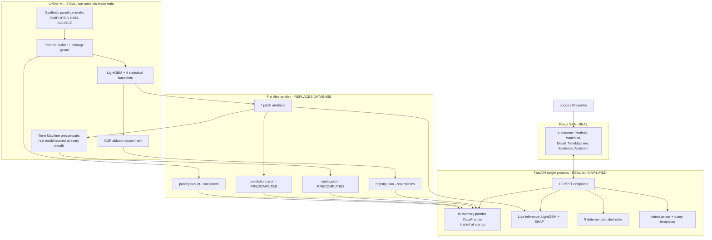

# PAIMANA PEWS — Judge-Facing Prototype Technical Approach

**Project:** AI-Powered Predictive Analytics & Early Warning System for Central Sector Infrastructure Projects (MoSPI / PAIMANA)
**Document type:** Build-ready blueprint for an AI coding agent
**Optimised for:** A 4-minute live demonstration to hackathon judges
**Not optimised for:** Production scale, multi-user load, or organisational deployment

> **The one-line brief for the coding agent:** Build a polished single-page dashboard, backed by one small FastAPI process, that runs a *genuinely trained* LightGBM model over a synthetic-but-realistic panel of 6,000 infrastructure projects, and proves — visibly, on screen, in under four minutes — that the model would have flagged a doomed project eleven months before the government's own system recorded any problem.

---

## 0. Assumptions (binding — do not renegotiate mid-build)

| # | Assumption | Consequence for the build |
|---|---|---|
| A1 | We have **no access** to the live PAIMANA database or API. | All project data is synthetically generated to a PAIMANA-faithful schema. This is stated openly in the demo, not hidden. |
| A2 | The CUF (Common Upload Form) field list is not published. We define a CUF-equivalent schema from the fields named in the problem statement plus MoSPI Flash Report columns. | `data/schema.py` holds the field list; swapping in the real CUF is a one-file change. |
| A3 | Calibration anchors from the problem statement: 1,981 ongoing projects, 17 ministries, 22 sectors, ₹37.13 lakh crore original cost, ₹42.78 lakh crore revised (**≈15.2% aggregate overrun**), ₹20.36 lakh crore spent (**≈47.6% of revised**). | The generator must reproduce these headline numbers so the dashboard's top-line KPIs match the real published figures exactly. Judges may recognise them. |
| A4 | Demo hardware: one laptop, 8–16 GB RAM, **no GPU**, **assume no internet during the presentation**. | Everything runs locally. Zero network calls at demo time. No hosted LLM. |
| A5 | Build time available: roughly 2–3 focused days. | Scope is cut hard. See §5 and §16. |
| A6 | Judges include domain people (MoSPI / infrastructure) and technical people. | The demo must satisfy both: a policy story *and* a real model with real evaluation evidence. |

---

## 1. Core Principle Applied to This Project

**Simplify aggressively:** PostgreSQL → in-memory pandas. Alembic migrations → none. Docker Compose → none. Auth → none. Celery/schedulers → none. Vector DB → none. LLM → templated, deterministic assistant. PDF ingestion → dropped.

**Do NOT fake:** The prediction itself. The core innovation of this project is that *a model can see a project failing before the official record does*. If that is faked, the entire submission is worthless. Therefore:

- LightGBM is **actually trained** on ~250,000 real feature rows via `make train`.
- SHAP values are **actually computed** with `TreeExplainer` on the trained model.
- The statistical baselines (OLS, logistic, Weibull AFT, sector-median) are **actually fitted** and **actually lose**.
- The leakage guard is **actually enforced**, including a shuffled-label test.
- The Time Machine replay re-runs the **real model** at each historical month, not a scripted animation.

**The honest boundary:** The *data* is synthetic. The *modelling* is real. Say exactly that on stage.

---

## 2. Two Separate Plans

### A. Judge-Facing Prototype Plan — **BUILD THIS NOW**

One FastAPI process + one React SPA + committed model artefacts + Parquet/JSON data files on disk. No database, no containers, no auth, no cloud. Starts with a single command in under 15 seconds. Six screens, all of them functional. Model trained once offline; predictions precomputed at startup and cached in memory; live inference available for the what-if panel and the Time Machine.

### B. Future Production Plan

> **FUTURE / PRODUCTION — NOT REQUIRED FOR THE DEMO**

- PostgreSQL 16 with `snapshot_month` partitioning, Alembic migrations, read replica for analytics.
- Authenticated ingestion from the real PAIMANA API on the monthly cycle; NIC SSO; ministry-scoped row-level access control.
- Containerised deployment on NIC / MeghRaj, two API replicas behind a load balancer (still no GPU required).
- Monthly automated retraining with a champion/challenger promotion gate and a frozen benchmark set.
- Feature-drift and data-freshness monitoring; Prometheus metrics; alerting on scoring-job failure.
- Survival models promoted from baseline to primary, because right-censoring of never-completing projects is a real and material effect at production scale.
- Human-in-the-loop workflow: assign → escalate → record intervention → measure outcome, which also generates the feedback labels that improve the model.
- Formal model card, published methodology note, and a dispute/appeal route for ministries contesting a score.
- Email/SMS alert delivery and a mobile view for field officers.

None of the above is built now. Every item above is a *talking point* for the "how does this become real?" question, not a work item.

---

## 3. Feature Visibility Analysis

| Feature | Visible to Judge? | Prototype Implementation | Backend Complexity | Priority |
|---|---|---|---|---|
| Portfolio KPIs matching real published MoSPI figures | **Yes — first 5 seconds** | Aggregations over in-memory DataFrame | Low | **P0 Critical** |
| Risk-ranked watchlist of 1,981 ongoing projects | **Yes — the core deliverable** | Sorted DataFrame, real model scores | Low | **P0 Critical** |
| Cost & time overrun prediction with p10–p90 interval | **Yes** | Real LightGBM quantile regression | Medium | **P0 Critical** |
| **Time Machine replay** (risk score rising months before the official flag) | **Yes — the hero moment** | Real model re-scored at each historical month, precomputed into JSON | Medium | **P0 Critical** |
| SHAP explanation waterfall per project | **Yes — proves it isn't a black box** | Real `TreeExplainer`, precomputed | Medium | **P0 Critical** |
| Progress-vs-expenditure divergence chart | **Yes — instantly legible** | Recharts dual-axis from snapshot history | Low | **P0 Critical** |
| Evidence page: ML vs conventional statistics | **Yes — answers scope dimension (b)** | Real experiment output read from `registry.json` | Low | **P0 Critical** |
| Evidence page: CUF-sufficiency ablation | **Yes — answers scope dimension (c)** | Real 3-run ablation output | Low | **P0 Critical** |
| Rule-based alerts with plain-language reasons | **Yes** | 8 deterministic Python rules | Low | **P1 High** |
| Live upload → rescore cycle | **Yes — proves it's a system, not a slide** | CSV upload, pandas validation, in-memory rescore | Low | **P1 High** |
| Natural-language assistant | **Yes — memorable close** | Intent parser + parameterised query templates | Low | **P1 High** |
| Sector/ministry benchmarking | Yes, briefly | GroupBy + percentile rank | Low | **P1 High** |
| What-if sliders on project detail | Yes, if time | Live `/predict` call to the real model | Low | **P2 Polish** |
| CSV export of the watchlist | Marginal | Client-side blob download | Trivial | **P2 Polish** |
| Alert acknowledgement workflow | Barely | In-memory dict, resets on restart | Low | **P2 Polish** |
| Local LLM (Ollama) narration | Slightly | Optional flag, off by default | Medium | **P3 Future** |
| MoSPI Flash Report PDF parser | **No** | Not built | High | **P3 Future** |
| Authentication / RBAC | **No** | Not built | High | **P3 Future** |
| PostgreSQL + migrations | **No** | Not built | Medium | **P3 Future** |
| Docker / Kubernetes / CI-CD | **No** | Not built | High | **P3 Future** |
| Scheduled retraining | **No** | Not built (CLI command only) | Medium | **P3 Future** |
| Deep learning / LSTM / Transformer models | **No** | Not built — GBDT is genuinely better here | High | **P3 Future** |

**Ruling principle applied:** anything a judge cannot see in four minutes and cannot be *told about in one sentence* is not built.

---

## 4. Judge Demo Flow

### Flow diagram

```mermaid
flowchart TD
    A["Presenter opens app - already running"] --> B["PORTFOLIO OVERVIEW<br/>1,981 projects, Rs 42.78 lakh crore<br/>214 CRITICAL, Rs 3.1 lakh crore at risk"]
    B --> C["Click WATCHLIST"]
    C --> D["Top 50 ranked by risk<br/>Toggle: weight by rupee exposure<br/>Ranking visibly reorders"]
    D --> E["Click hero project PRJ-004217"]
    E --> F["PROJECT DETAIL<br/>Expenditure climbing, progress flat<br/>Prediction: +23.4 percent cost, +14 months"]
    F --> G["Open SHAP panel<br/>Model shows WHY"]
    G --> H["Click TIME MACHINE"]
    H --> I["Scrub through 36 months<br/>Risk line crosses 60 in Nov 2024<br/>Official revision marker appears Oct 2025"]
    I --> J["THE PROOF:<br/>11 months of warning"]
    J --> K["Go to UPLOAD<br/>Drop next month CSV, click Run Scoring"]
    K --> L["1,981 projects rescored in ~2 seconds<br/>3 new projects enter CRITICAL"]
    L --> M["ASSISTANT<br/>Which railway projects have stalled 3+ months?"]
    M --> N["Grounded answer, 7 clickable projects<br/>Show the SQL that produced it"]
    N --> O["EVIDENCE PAGE<br/>LightGBM 0.78 vs AFT 0.69 vs OLS 0.64<br/>CUF-only reaches 82 percent of full performance"]
    O --> P["IMPACT:<br/>Descriptive monitoring becomes<br/>predictive early warning"]
```



### Step-by-step

**Demo Start.** The app is already running on `localhost:5173`. The judge sees the Portfolio Overview: five KPI cards showing 1,981 monitored projects, ₹42.78 lakh crore revised portfolio value, ₹5.65 lakh crore already overrun, 214 projects in the CRITICAL band, and ₹3.1 lakh crore of exposure at risk. Below: a risk-band donut and a sector × risk-band heatmap where Railways and Urban Development glow red.

**User Action 1.** Presenter clicks **Watchlist**.

**System Response.** A ranked table of the 50 riskiest projects appears in under 200 ms. Presenter flips the "Weight by financial exposure" toggle; the ranking visibly reorders, because a 62%-risk ₹5,200 crore project matters more than an 84%-risk ₹210 crore one. This single toggle communicates that the system understands *money*, not just probability.

**User Action 2.** Presenter clicks row 1 — the hero project.

**AI/Technical Demonstration.** Project Detail loads. Chart one: cumulative expenditure rising steadily while physical progress flattens at 41% from month 14 — the visual signature of a project burning money without delivering. The prediction card shows +23.4% cost overrun (p10–p90: 9.1% to 41.6%) and +14.2 months delay, with calibrated probabilities. Presenter opens the SHAP waterfall: progress gap +8.9, stalled velocity +6.2, land-acquisition delay reason +3.3.

Then presenter clicks **Time Machine** — the decisive moment. A slider scrubs across 36 monitoring months. At each month, the risk score shown is the *real model's output using only data visible at that month*. The line climbs and crosses the alert threshold in November 2024. A separate marker on the same axis shows when the *official* system first recorded a revised completion date: October 2025.

**Result.** The gap is annotated on screen: **11 months of early warning.**

**Final Impact.** Presenter says: *"PAIMANA told the Ministry there was a problem in October 2025. The signal was already in PAIMANA's own data in November 2024. We didn't add a single new field — we just read the data that was already being collected."* Then the live rescore, the assistant query, and the evidence page close the loop on the three technical questions the problem statement actually asked.

---

## 5. MVP Definition for This Project

> **MVP = the smallest working prototype that convincingly proves the solution to a judge in four minutes.**

### MUST SHOW (P0)

| Feature | Why it must be shown |
|---|---|
| Portfolio Overview with real MoSPI headline figures | Establishes credibility in the first five seconds. If the numbers match what the judges know, everything after is taken seriously. |
| Risk-ranked Watchlist with exposure weighting | This *is* the product. Everything else is explanation. |
| Project Detail with divergence chart + prediction interval | Turns an abstract score into a legible story about one project. The interval shows honesty about uncertainty. |
| SHAP explanation panel | A government analyst cannot act on an unexplained score. Judges will ask "why did it say that?" — this is the answer, on screen, in one click. |
| **Time Machine replay** | The single most convincing artefact in the whole build. It converts a claim ("we predict early") into a demonstrated fact with a number attached. |
| Evidence page (ML vs statistics, CUF ablation) | The problem statement asks two explicit research questions. Answering them with real experiments, displayed on screen, separates this from a generic dashboard. |
| Real trained model + leakage guard | The core innovation. Cannot be simplified. |

### SHOULD SHOW (P1)

| Feature | Why |
|---|---|
| Live upload → rescore | Proves this is an operating system with a monthly cycle, not a static demo. Costs ~2 hours; adds enormous perceived realism. |
| Rule-based alerts | Shows the design maturity of *not* relying solely on ML — auditable rules catch data-quality failures a regressor smooths over. |
| Assistant (templated) | The problem statement names LLM-enabled intelligence. A deterministic grounded assistant delivers the visible value with none of the demo risk. |
| Benchmarking screen | Answers "is 20% overrun bad?" with sector context. One chart, thirty minutes of work. |

### OPTIONAL (P2)

| Feature | Why only if time permits |
|---|---|
| What-if sliders | Impressive interactive moment, but the Time Machine already proves live inference works. |
| Watchlist CSV export | Small credibility touch; trivial to build. |
| Alert acknowledgement | Shows the workflow closing; low visual impact. |

### DO NOT BUILD (P3)

| Feature | Why not |
|---|---|
| Authentication | Consumes half a day, demonstrates nothing. One sentence covers it in Q&A. |
| PostgreSQL + Alembic | 6,000 projects fit in 40 MB of RAM. A database adds setup fragility and zero visible value. |
| Docker / Kubernetes | The demo runs on a laptop. Containers are a *risk* here, not a benefit. |
| Local LLM (Ollama) | 4–12 s CPU latency on a 7B model during a live demo is a real failure mode for marginal gain. Templated answers are instant and cannot hallucinate. |
| Flash Report PDF parser | Government PDF tables are irregular; it could eat a day and still fail. Mention as roadmap. |
| Deep learning models | On 250k rows of tabular data, GBDT wins. Adding an LSTM costs a day and *lowers* accuracy. |
| Real-time streaming / Kafka | The monitoring cycle is monthly. Streaming is architecturally meaningless here. |
| Scheduled retraining | A CLI command demonstrates the same capability. |

---

## 6. Prototype Architecture

### Diagram



### Component status table

| Component | Status | Rationale |
|---|---|---|
| React SPA | **REAL** | It is the demo surface. Must be genuinely good. |
| FastAPI service | **REAL, SIMPLIFIED** | Single process, no auth, no ORM, no migrations. Real HTTP, real JSON contracts. |
| LightGBM models | **REAL** | The core innovation. Trained by `make train` on ~250k rows. |
| SHAP explanations | **REAL** | Genuine `TreeExplainer` output. |
| Statistical baselines | **REAL** | Genuinely fitted and genuinely compared. |
| Feature builder + leakage guard | **REAL** | The technically hardest and most defensible part of the project. |
| Project dataset | **SIMPLIFIED — synthetic** | No access to PAIMANA (A1). Schema-faithful and calibrated to published aggregates. **Disclosed on stage.** |
| Portfolio predictions | **PRECOMPUTED** | Scored once at build time into `predictions.json` for instant page loads. |
| Time Machine replay data | **PRECOMPUTED** | Real model, real monthly re-scoring, computed offline so the slider is buttery. |
| Live `/predict` and rescore | **REAL** | Uses the same loaded model, proving inference is live and not canned. |
| Database | **REPLACED by in-memory pandas + Parquet** | 6,000 projects = ~40 MB. A DB adds fragility, not value. |
| Alert acknowledgements | **IN-MEMORY, resets on restart** | Acceptable; disclosed in README. |
| Assistant | **REAL but templated** | Deterministic intent → parameterised query → template. Cannot hallucinate a number. |
| Authentication | **NOT BUILT** | Future. |
| External APIs | **NONE** | Zero network calls at demo time. |

---

## 7. Real vs Mocked Components

| Component | Prototype | Production |
|---|---|---|
| Frontend | **Real** React SPA, 6 screens, all functional | Same, plus role-based views and mobile layout |
| Backend | **Real but minimal** — one FastAPI process, in-memory data | Containerised, replicated, behind a load balancer |
| AI model | **Real** — LightGBM genuinely trained, artefacts committed | Same algorithm; per-sector models, drift monitoring, monthly retrain with promotion gate |
| Explanations | **Real** TreeSHAP | Same |
| Statistical baselines | **Real**, genuinely fitted | Same, plus survival models promoted to primary |
| Dataset | **Synthetic**, PAIMANA-schema, calibrated to published aggregates | Live PAIMANA / OCMS historical panel via authenticated API |
| Portfolio scoring | **Precomputed** at build, live rescore available on demand | Scheduled monthly batch job |
| Time Machine | **Precomputed** from real per-month model inference | Computed on demand from stored prediction history |
| Database | **None** — Parquet + JSON on disk, pandas in memory | PostgreSQL 16, partitioned, with backups and a read replica |
| API | **Real REST**, no auth | Same contracts, plus auth, rate limiting, audit logging |
| Authentication | **Not implemented** | NIC SSO + ministry-scoped row-level security |
| Assistant | **Real but templated** — deterministic, non-generative | Optional local LLM narration over the same grounded query results |
| External services | **None** | PAIMANA API, notification gateway |
| Deployment | `make demo` on a laptop, offline | NIC / MeghRaj hosting |
| Monitoring | stdout logs | Prometheus, drift dashboards, freshness alarms |

**This table goes in the README and on a slide.** Judges reward teams who state their simplifications before being asked.

---

## 8. Core AI/Technical Component — The One Thing That Must Actually Work

### 8.1 What it does

Given a project's monitoring snapshot **as of month *t***, predict the **final** cost overrun percentage and schedule delay that project will end up with at completion — using only information that was genuinely visible at month *t*.

### 8.2 Input

A feature vector of ~44 columns built from the CUF-equivalent schema, in three groups (this grouping is also the ablation partition):

- **Group C — CUF fields:** sector, ministry, state, implementing agency, funding mode, original cost (log), original duration, sanction year, elapsed months, physical progress %, cumulative expenditure, current status.
- **Group D — Derived from CUF (no new data collection):** `progress_gap` (financial progress minus physical progress), `elapsed_fraction`, `schedule_perf_index`, `cost_perf_index`, `progress_velocity_3m`, `velocity_deficit` (required pace minus actual pace), `stall_months_3m`, `n_date_revisions`, `n_cost_revisions`, `realized_overrun_to_date`, `months_since_update`.
- **Group E — External enrichment (not in CUF today):** sector cost-index delta, agency historical overrun (out-of-fold encoded), sector historical overrun, concurrent agency workload, delay-reason category, monsoon exposure.

### 8.3 Processing

Four LightGBM models plus three quantile heads per regressor:

| Model | Target | Objective |
|---|---|---|
| `cost_reg` + `cost_q10/q50/q90` | Final cost overrun % | `l2` + `quantile` |
| `time_reg` + `time_q10/q50/q90` | Final delay in months | `l2` + `quantile` |
| `cost_clf` | P(final cost overrun > 10%) | `binary`, isotonically calibrated |
| `time_clf` | P(final delay > 6 months) | `binary`, isotonically calibrated |

Plus four conventional baselines fitted on identical splits: sector-median naive, OLS on log-cost with sector dummies, logistic regression, and a Weibull Accelerated Failure Time survival model.

### 8.4 Output

```json
{
  "project_id": "PRJ-004217",
  "as_of_month": "2026-04",
  "cost": { "point_pct": 23.4, "p10": 9.1, "p50": 22.8, "p90": 41.6, "prob_overrun": 0.81 },
  "time": { "point_months": 14.2, "p10": 4.0, "p50": 13.5, "p90": 29.0, "prob_delay": 0.87 },
  "risk_score": 78.4,
  "risk_band": "CRITICAL",
  "exposure_at_risk_cr": 1284.6,
  "drivers": [
    { "feature": "progress_gap", "value": 27.4, "shap": 8.9,
      "text": "Expenditure is 27 percentage points ahead of physical progress." },
    { "feature": "stall_months_3m", "value": 3, "shap": 6.2,
      "text": "No measurable physical progress for 3 consecutive cycles." }
  ],
  "alerts": [{ "rule_id": "R1_PROGRESS_STALL", "severity": "HIGH", "message": "..." }]
}
```

### 8.5 How the prototype implements it

**Training is real and required. Run it once, commit the artefacts.**

The critical technical move — and the thing the coding agent must get right — is **snapshot expansion**. For every project that has already *completed*, we know its final outcome. So we rewind it to each monitoring month, mask everything that happened afterwards, and emit one training row per month labelled with the project's known final outcome. Roughly 4,000 completed projects × ~60 months ≈ **250,000 training rows** from a modest project count.

```python
def build_snapshots(project_rows, min_elapsed=3):
    """project_rows: monthly rows for ONE project, sorted ascending."""
    out = []
    for i, row_t in enumerate(project_rows):
        elapsed = months_between(project_rows[0].sanction_date, row_t.snapshot_month)
        if elapsed < min_elapsed:
            continue
        history = project_rows[: i + 1]        # <-- THE LEAKAGE BOUNDARY. Nothing after i.
        feats = {}
        feats.update(static_cuf(project_rows[0]))
        feats.update(dynamic_cuf(row_t, elapsed))
        feats.update(derived(history))
        feats.update(external(row_t, history))
        feats["as_of_month"] = row_t.snapshot_month
        feats["source_max_month"] = history[-1].snapshot_month   # asserted in tests
        if is_completed(project_rows):
            feats["y_cost"]      = final_cost_overrun_pct(project_rows)
            feats["y_time"]      = final_delay_months(project_rows)
            feats["y_cost_flag"] = int(feats["y_cost"] > 10)
            feats["y_time_flag"] = int(feats["y_time"] > 6)
        out.append(feats)
    return out
```

**Leakage prevention — write these tests BEFORE the training code.** Four channels must be closed:

1. **Post-hoc field leakage.** `actual_cost_cr`, `actual_commissioning_date`, and any snapshot with `month > t` encode the answer. → Explicit blacklist, asserted before every `fit()` and `predict()`.
2. **Group leakage.** A random split puts month 11 of project P in train and month 12 in test — near-identical rows sharing a label. Reported R² approaches 0.99 and means nothing. → **All splits grouped by `project_id`.**
3. **Temporal leakage.** Sector/agency historical encodings computed over the whole dataset leak future outcomes into past rows. → Encoders fitted on the training window only, out-of-fold.
4. **Survivorship bias.** Only completed projects have labels, so permanently-stalled projects never appear. → Partially mitigated by the AFT baseline modelling censoring; documented as a known limitation, not hidden.

```python
# tests/test_leakage.py — build-breaking. All four must pass.
def test_blacklist_enforced():
    X, _ = build_features(panel)
    assert not set(X.columns) & set(BLACKLIST)

def test_project_disjoint_splits():
    tr, va, te = make_splits(snapshots)
    assert not (set(tr.project_id) & set(te.project_id))

def test_no_future_rows():
    snap = build_snapshot(rows, as_of="2020-06")
    assert snap.source_max_month <= pd.Timestamp("2020-06-01")

def test_shuffled_labels_give_no_skill():
    """The single strongest defence: if a model trained on RANDOM labels still
    scores well on the test set, there is leakage. Fail the build."""
    m = train_model(X_train, shuffle(y_train))
    assert roc_auc_score(y_test, m.predict_proba(X_test)[:, 1]) < 0.60
```

**Hyperparameters (fixed, do not tune during the build):**

```yaml
regression:  { objective: regression_l2, n_estimators: 600, learning_rate: 0.05,
               num_leaves: 63, max_depth: 8, min_child_samples: 80,
               subsample: 0.8, colsample_bytree: 0.8, early_stopping_rounds: 50 }
classification: { objective: binary, is_unbalance: true, n_estimators: 500,
                  learning_rate: 0.05, num_leaves: 31, min_child_samples: 100 }
quantile:    { objective: quantile, alpha: [0.1, 0.5, 0.9], n_estimators: 500 }
```

`min_child_samples` is deliberately high: adjacent monthly snapshots of one project are near-duplicates, and small leaves let the model memorise individual projects.

### 8.6 Why this is sufficient for the demo

The judges' technical question is *"does the AI actually do something, and is the claim defensible?"* This build answers yes on four counts a slide deck cannot: (1) the model file exists and was produced by a reproducible command; (2) the leakage tests are the hardest part of this problem and they pass, including the shuffled-label test; (3) the model measurably beats four conventional statistical methods on identical splits; (4) the Time Machine shows the model's actual month-by-month output, not an animation.

### 8.7 Why we are NOT fine-tuning an LLM

Stating this explicitly because the problem statement mentions LLMs and the reflex is to reach for one.

The core task is **numeric prediction from ~44 structured tabular features**. LLMs are substantially worse than gradient-boosted trees at this, thousands of times slower, cannot produce a calibrated probability, and cannot produce an exact feature attribution. There is no instruction dataset to fine-tune on, and building one would consume the entire hackathon to yield something worse than a 4 MB LightGBM file. Fine-tuning also requires a GPU, violating A4.

The only genuine language surface is phrasing answers about retrieved data — solved by deterministic templates with zero latency and zero hallucination risk. **This is a considered engineering decision, not an omission, and the presenter should say so if asked.**

### 8.8 How it scales to production

The algorithm does not change. What changes is the data source (real PAIMANA panel instead of synthetic), the addition of per-sector model families where volume permits, a monthly automated retrain with a promotion gate, drift monitoring on feature distributions, and survival models promoted from baseline to primary to handle real right-censoring. Notably, **even at full national scale this needs no GPU and no cluster** — twenty years of national infrastructure monitoring is under 10 GB.

---

## 9. Prototype Data Strategy

### 9.1 Approach: synthetic panel, calibrated to published aggregates, with hand-curated hero projects

| Slice | Count | Purpose |
|---|---|---|
| Completed projects (2006–2025) | ~4,000 | Labelled training data (~250,000 snapshot rows) |
| Ongoing projects | **1,981** | Matches the real figure exactly; this is the scored portfolio the dashboard displays |
| Monthly snapshots total | ~330,000 | ~55 MB Parquet |
| Hand-curated demo projects | 4 | Guarantee the demo tells a clean story (§12) |

### 9.2 Generator requirements — these determine whether the model is meaningful

The coding agent must implement all of these. Skipping them produces a model with an unrealistic 0.97 AUC and an evaluation that means nothing.

1. **Latent unobservables.** Each project gets hidden variables (`true_complexity`, `agency_capability`, `land_burden`, `political_priority`) that drive outcomes. Features only see noisy downstream effects. **Without these, the model reverse-engineers the generator and every metric is fake.**
2. **Aggregate calibration (A3).** Generated ongoing portfolio must hit ₹37.13 lakh crore original, ₹42.78 lakh crore revised (±2pp on the 15.2% overrun), ₹20.36 lakh crore spent (±3pp). **Asserted by a test.**
3. **Sector heterogeneity.** Railways and Urban Development worse; Petroleum and Telecom better. Judges from the domain will notice if this is uniform.
4. **Regime shift.** Post-2020 sanctions have a different escalation distribution, so the temporal test split is genuinely out-of-distribution.
5. **Realistic missingness.** 5–12% of monthly snapshots stale or missing. Monotonic non-decreasing expenditure and progress, with occasional flat runs.
6. **Censoring.** ~4% of projects stall permanently and never complete.
7. **Free-text delay reasons** drawn from a realistic phrase bank across 9 categories: land acquisition, forest/environment clearance, contractor/EPC, funds, litigation, R&R, ROW/utility shifting, statutory approvals, force majeure.

### 9.3 Schema (CUF-equivalent — assumption A2)

`data/raw/snapshots.csv`, one row per project per monitoring month:

| Field | Type | Required | Notes |
|---|---|---|---|
| `project_id` | str | ✅ | |
| `project_name` | str | ✅ | Plausible names, e.g. "Doubling of Rail Line Section-IV" |
| `ministry` | str | ✅ | One of 17 |
| `sector` | str | ✅ | One of 22 |
| `state` | str | ✅ | `MULTI` for inter-state |
| `implementing_agency` | str | ✅ | NHAI, RVNL, NTPC, CPWD, etc. |
| `funding_mode` | str | ❌ | budgetary / EBR / PPP / mixed |
| `sanction_date` | date | ✅ | Month precision throughout |
| `original_cost_cr` | float | ✅ | ₹ crore, > 150 |
| `original_commissioning_date` | date | ✅ | |
| `snapshot_month` | date | ✅ | |
| `anticipated_cost_cr` | float | ❌ | Latest revised cost |
| `anticipated_commissioning_date` | date | ❌ | Latest revised date |
| `expenditure_cr` | float | ✅ | Cumulative |
| `physical_progress_pct` | float | ✅ | 0–100 |
| `project_status` | str | ✅ | ongoing / completed / suspended |
| `reason_for_delay` | str | ❌ | Free text |
| `actual_cost_cr` | float | ❌ | **Label only. Blacklisted from features.** |
| `actual_commissioning_date` | date | ❌ | **Label only. Blacklisted from features.** |

### 9.4 Example records

```csv
project_id,project_name,ministry,sector,state,implementing_agency,sanction_date,original_cost_cr,original_commissioning_date,snapshot_month,anticipated_cost_cr,anticipated_commissioning_date,expenditure_cr,physical_progress_pct,project_status,reason_for_delay
PRJ-004217,Doubling of Rail Line Section-IV,Ministry of Railways,Railways,Odisha,RVNL,2021-06-01,3120.0,2025-06-01,2024-11-01,3120.0,2025-06-01,1782.4,41.0,ongoing,Land acquisition pending in 3 villages
PRJ-004217,Doubling of Rail Line Section-IV,Ministry of Railways,Railways,Odisha,RVNL,2021-06-01,3120.0,2025-06-01,2025-10-01,3610.0,2026-09-01,2455.1,52.0,ongoing,Land acquisition and forest clearance
PRJ-001188,Grid Substation Augmentation Phase II,Ministry of Power,Power,Gujarat,PGCIL,2023-01-01,640.0,2026-04-01,2026-04-01,640.0,2026-04-01,588.0,94.0,ongoing,
```

### 9.5 Precomputed artefacts shipped with the repo

| File | Contents | Why precomputed |
|---|---|---|
| `data/processed/panel.parquet` | Full monthly snapshot panel (~55 MB) | Load once at API startup |
| `data/processed/predictions.json` | Latest-month scores for all 1,981 ongoing projects, with SHAP drivers and alerts | Instant page loads; no model call needed for browsing |
| `data/processed/replay.json` | Time Machine data: per-hero-project, per-month real model output | Slider must be instant; the model calls happened at build time |
| `models/registry.json` | Real metrics, baseline comparison, ablation results | The Evidence page reads this directly — no hardcoded numbers |
| `models/v1/*.joblib` | Trained model artefacts (~4 MB) | Committed so the demo never trains on stage |

---

## 10. UI / UX Requirements

### 10.1 Design system — lock these values, do not improvise

The single biggest risk to a judge-facing dashboard is that it looks like a default component library. Fix the visual language up front.

```
Font:        Inter (400/500/600/700) via @fontsource/inter — bundled, no CDN
Numerals:    font-variant-numeric: tabular-nums on ALL numeric cells
Background:  #F8FAFC (slate-50)          Surface: #FFFFFF
Border:      #E2E8F0 (slate-200)         Text: #0F172A / muted #64748B
Accent:      #1E40AF (deep institutional blue — government-serious, not startup-purple)
Risk bands:  LOW #16A34A · WATCH #CA8A04 · HIGH #EA580C · CRITICAL #DC2626
Radius:      8px cards, 6px buttons      Shadow: 0 1px 3px rgba(15,23,42,0.08)
Spacing:     4px scale (Tailwind default)
Charts:      Recharts, 2px stroke, no gridline clutter, tooltips always on
```

**Non-negotiable UI rules:**
- Risk bands **always** carry a text label, never colour alone (accessibility, and it reads better in a projected room).
- All money formatted as `₹1,284 Cr` or `₹42.78 L Cr` via one shared `formatCrore()` helper. Never raw floats.
- Every numeric column right-aligned with tabular numerals so the table doesn't shimmer.
- Every data-fetching view has a skeleton loader and an error state. **Zero blank screens.**
- No dead buttons anywhere. If it's rendered, it works (§11).

### 10.2 Screens

---

#### Screen 1 — Portfolio Overview (`/`)

**Purpose.** Establish scale and credibility in the first five seconds. These are the real published MoSPI numbers.

**Visible components.** Header bar with the PEWS mark, a "Data: synthetic, PAIMANA-schema" honesty chip, and a model-version badge. Five KPI cards. A risk-band donut. A sector × risk-band heatmap. A top-10 global drivers bar chart.

**User actions.** Ministry filter dropdown; sector filter dropdown; click any heatmap cell → navigates to a pre-filtered Watchlist.

**Data displayed.** 1,981 monitored projects · ₹42.78 L Cr revised portfolio · ₹5.65 L Cr already overrun · 214 CRITICAL · ₹3.1 L Cr exposure at risk.

**AI output.** Risk-band distribution and the driver ranking both come from the real model (aggregated SHAP).

**Loading state.** Skeleton KPI cards with shimmer; charts render as soft grey blocks.
**Error state.** Inline card: "Could not reach scoring service — showing cached portfolio" + Retry button. Never a blank page.
**Transition.** Top nav to any screen; heatmap cell → Watchlist with filters applied.

---

#### Screen 2 — Watchlist (`/watchlist`)

**Purpose.** The operational deliverable — *which projects do I look at this month?*

**Visible components.** Filter bar (ministry, sector, risk band, min cost). A prominent **"Weight by financial exposure"** toggle. Top-N slider (10/25/50/100). A ranked table: rank · project name · sector · original cost · physical progress bar · risk score chip · predicted cost overrun · predicted delay · exposure at risk · alert count. "Export CSV" button (P2).

**User actions.** Filter, toggle exposure weighting, adjust N, sort by column, click a row.

**Data displayed.** Live-sorted from the in-memory predictions frame.

**AI output.** Every risk score, predicted overrun, and probability is real model output.

**Loading state.** Eight skeleton rows.
**Error state.** Empty-state card with the current filters listed and a "Clear filters" button.
**Transition.** Row click → Project Detail.

> **Demo note:** the exposure toggle must visibly *reorder rows with a short transition*, not snap. This is a two-line Framer-Motion-free CSS transition and it is the moment judges realise the system reasons about money.

---

#### Screen 3 — Project Detail (`/project/:id`)

**Purpose.** Turn a score into a legible story about one project, and prove the model isn't a black box.

**Visible components.**
- Header: project name, ministry, sector, state, agency, sanction date, original cost, original completion date. A large risk gauge with the band label.
- **Chart A — Divergence:** dual-axis line chart, cumulative expenditure % vs physical progress %, over the full monitoring history. The gap between the lines is shaded. This is the single most legible visual in the app.
- **Prediction card:** cost overrun point estimate with a p10–p90 band rendered as a horizontal range bar; same for delay; both calibrated probabilities shown as percentages.
- **SHAP waterfall:** top 5 signed drivers with plain-language text under each.
- **Alerts list:** fired rules with severity chips and evidence values.
- **Peer panel (P1):** percentile rank within the same sector + cost band, as horizontal bars.
- **"Open Time Machine" button** — prominent, accent-coloured.
- **What-if sliders (P2):** adjust physical progress and expenditure → live `POST /api/predict` → prediction card updates.

**User actions.** Scroll, hover charts, open Time Machine, acknowledge an alert (P2), move what-if sliders (P2).

**AI output.** Everything in the prediction card, the SHAP panel, and the what-if response.

**Loading state.** Per-panel spinners so the header renders immediately.
**Error state.** Friendly 404 card with a "Back to Watchlist" link for unknown IDs.
**Transition.** → Time Machine (same project).

---

#### Screen 4 — Time Machine (`/project/:id/replay`) — **THE HERO SCREEN**

**Purpose.** Convert the claim "we predict early" into a demonstrated fact with a number.

**Visible components.**
- A month slider spanning the project's monitoring history (typically 36–54 months), with a play/pause button that auto-advances at ~4 months/second.
- A **risk trajectory line chart** that fills in as the slider moves, with a dashed horizontal alert threshold at 50.
- Two vertical markers on the same axis: **"Model first flagged"** (accent blue) and **"Official revision recorded"** (red).
- A large annotation banner between them: **"11 months of early warning"**.
- A synchronised mini-panel showing the model's state *at the selected month*: physical progress, expenditure, predicted overrun, top SHAP driver at that moment.

**User actions.** Drag the slider, press play, hover any point on the trajectory.

**Data.** `replay.json` — precomputed, but each point is genuine model output on that month's masked feature vector. **This is not an animation of a fixed curve.**

**Loading state.** Chart axes render immediately; the line animates in over ~400 ms.
**Error state.** If replay data is missing for a project, show "Replay available for demo projects" and list the four hero projects as links.
**Transition.** Back to Project Detail.

> **This screen justifies the entire project. Build it before any P1 feature.**

---

#### Screen 5 — Evidence (`/evidence`)

**Purpose.** Answer the two research questions the problem statement explicitly asks, with real experimental results.

**Visible components.**
- **Table 1 — Does ML beat conventional statistics?** Rows: Sector-median naive, OLS, Logistic regression, Weibull AFT, **LightGBM**. Columns: PR-AUC, ROC-AUC, Brier, MAE (cost pp), MAE (delay months). LightGBM row highlighted.
- **Table 2 — CUF sufficiency.** Rows: CUF only (Group C), + derived from CUF (C+D), + external enrichment (C+D+E). Columns: PR-AUC, delta, % of full performance. Caption states the conclusion in one sentence.
- **Calibration curve** (predicted probability vs observed frequency, with the diagonal).
- **Lead-time distribution** histogram across all correctly-flagged test projects, with the median called out.
- **Performance by project stage** — metrics sliced into early (0–33% elapsed), mid (33–66%), late (66–100%). *Accuracy at 90% elapsed is operationally worthless; accuracy at 30% is the whole point.*
- **Limitations panel** — synthetic data, survivorship bias, error bars. Plain text, prominently placed.

**User actions.** Read. Hover chart points. (Deliberately read-only.)

**Data.** `GET /api/registry` → `models/registry.json`. **Not a single number on this page may be hardcoded in the frontend.**

**Loading state.** Skeleton tables.
**Error state.** "Model registry unavailable — run `make train`" with the exact command shown.

---

#### Screen 6 — Assistant (`/assistant`)

**Purpose.** Deliver the "LLM-enabled project intelligence" outcome with zero demo risk.

**Visible components.** Chat column; four suggested-question chips; answer bubbles containing clickable project chips; an expandable **"How this was answered"** disclosure showing the executed query.

**Supported intents (8, deterministic):** `TOP_RISK`, `SECTOR_SUMMARY`, `MINISTRY_SUMMARY`, `STALLED_PROJECTS`, `PROJECT_LOOKUP`, `DRIVER_QUERY`, `COMPARE_SECTORS`, `COUNT_QUERY`. Anything else → a friendly fallback listing what it *can* answer.

**Suggested chips (pre-tested, use these exact strings):**
- "Which railway projects have stalled for 3 or more months?"
- "Show me the 5 highest-exposure critical projects"
- "What are the top drivers of cost escalation in Urban Development?"
- "Compare cost overrun risk across sectors"

**AI output.** Grounded answers built from real query results.

**Loading state.** Three-dot typing indicator for ~400 ms (deliberate — instant answers feel less considered).
**Error state.** Fallback message listing supported question types.

---

#### Screen 7 — Upload & Rescore (`/upload`) — P1

**Purpose.** Prove this is a system with a monthly operating cycle, not a static demo.

**Visible components.** Drag-and-drop zone; a "Use sample next-month file" button (**critical fallback** — never depend on the presenter finding a file live); a validation result panel (accepted / rejected counts + row-level error table); a "Run Scoring" button; a progress indicator; a results summary showing band transitions.

**User actions.** Drop a CSV or click the sample button → review validation → click Run Scoring → click through to the refreshed Watchlist.

**Data displayed.** "1,974 accepted, 7 rejected" with specific reasons per rejected row.

**AI output.** Full rescore of all 1,981 projects in ~2 seconds, with a summary such as "3 projects entered CRITICAL, 1 exited."

**Loading state.** Determinate progress bar during scoring.
**Error state.** Per-row validation errors displayed in a table with the offending field named. Malformed file → clear message, never a 500.

---

## 11. Features Must Actually Work

**Hard rule for the coding agent: if it renders, it responds correctly.**

| Element | Must do |
|---|---|
| Every nav link | Navigate to a populated screen |
| Every filter | Actually filter the data |
| Exposure toggle | Actually re-rank the table |
| Every table row | Open the correct project |
| Every chart | Render real data with working tooltips |
| Time Machine slider | Update every synced panel |
| Play button | Auto-advance and be pausable |
| Assistant chips | Return a correct grounded answer |
| Upload → Run Scoring | Actually revalidate and rescore |
| What-if sliders (if built) | Call the real model |
| Export CSV (if built) | Download a real file |

**Explicitly forbidden:** "Coming soon" panels, `alert()` placeholders, charts with `Math.random()` data, `<a href="#">`, disabled buttons with no explanation, lorem ipsum, `console.log` as a click handler.

If a feature cannot be made to work in the time available, **remove it from the UI entirely.** A five-screen app where everything works beats a nine-screen app with four dead ends — judges click the dead ones.

---

## 12. Demo Data Designed for Success

Four hand-curated hero projects, seeded with fixed IDs, guaranteeing the demo tells a clean story. The generator must special-case these.

### Scenario 1 — The Silent Failure (`PRJ-004217`) — **the main demo project**

Railway doubling project, Odisha, ₹3,120 Cr, sanctioned June 2021, original completion June 2025.
Physical progress climbs normally to 38% by month 14, then flattens. Expenditure keeps rising to 57%. No official cost or date revision is recorded until October 2025.

**Expected result:** Risk score 78.4, CRITICAL, predicted +23.4% cost and +14.2 months. Top SHAP driver: `progress_gap`. Rules R1 (stall) and R2 (spend ahead of work) fire.
**Time Machine result:** model crosses the 50 threshold in **November 2024**; official revision marker at **October 2025** → **11 months of early warning.**
**Why it works:** the divergence chart is instantly legible to a non-technical judge, and the eleven-month gap is a hard, quotable number.

### Scenario 2 — The Healthy Project (`PRJ-001188`)

Power grid substation, Gujarat, ₹640 Cr, 94% complete, on schedule, on budget.

**Expected result:** Risk score 12.6, LOW. No alerts. Predicted overrun +1.2% with a tight interval.
**Why it matters:** proves the system doesn't cry wolf. Show this *immediately after* Scenario 1 — the contrast makes the model look discriminating rather than alarmist. Judges will otherwise wonder whether everything scores red.

### Scenario 3 — The Vindicated Prediction (`PRJ-002904`) — **completed project, full hindsight**

Urban metro extension, completed 2024, final overrun +47%, final delay 22 months.

**Expected result:** Full Time Machine replay across its entire life, with the model's risk trajectory shown against the actual recorded events. The model flagged it at 34% elapsed; the first official date revision came at 61% elapsed.
**Why it matters:** Scenario 1 is a *prediction* (unfalsifiable today). Scenario 3 is a *verified* prediction against a known outcome. Use it if a judge presses on "but how do you know you're right?"

### Scenario 4 — The Data Quality Case (`PRJ-003355`)

₹890 Cr road project with no progress update for three monitoring cycles.

**Expected result:** Rule R6 (stale reporting) fires with MEDIUM severity, independent of the ML models. Risk shown with an "insufficient recent data" warning chip.
**Why it matters:** demonstrates design maturity — the system doesn't blindly trust the model, and it surfaces monitoring gaps that are themselves a finding for MoSPI.

**Rule for all four:** these must be verified working after every significant change. Add `tests/test_demo_scenarios.py` asserting the exact expected band and lead-time for each. If a demo scenario breaks, the build is broken.

---

## 13. Prototype Technical Approach

### Frontend
React 18 + Vite + TypeScript + Tailwind CSS + Recharts + TanStack Query + React Router v6. Bundled Inter font (no CDN — offline requirement). Typed API client hand-written in `src/api/client.ts` against the contracts in §14. No component library beyond Tailwind — a small set of hand-built primitives (`Card`, `KpiCard`, `RiskBadge`, `DataTable`, `Skeleton`) gives a more distinctive, professional result than default MUI/Bootstrap, which judges have seen forty times.

### Application Logic
TanStack Query handles all fetching, caching, loading and error states — no hand-rolled `useEffect` fetch code. Filter and sort state lives in URL search params so the presenter can deep-link and browser-refresh mid-demo without losing context. Portfolio-wide data is fetched once and cached with `staleTime: Infinity`; only `/predict` and `/score/run` bypass the cache.

### AI/ML
LightGBM 4.x, scikit-learn 1.5, SHAP 0.45, statsmodels, lifelines, pandas 2.x. Training is offline via `make train` (~4–6 minutes on a laptop CPU); artefacts are committed. At runtime the API loads the `.joblib` artefacts into memory at startup and serves live inference for `/predict` and `/score/run`. Portfolio browsing reads precomputed `predictions.json` for instant loads.

### Data
Synthetic panel (§9) in `data/processed/panel.parquet` (~55 MB), loaded once into a pandas DataFrame at API startup (~2 s, ~200 MB RAM). Precomputed `predictions.json`, `replay.json`, `registry.json`.

### Storage
**No database.** Flat files on disk + in-memory pandas. Alert acknowledgements live in a module-level dict and reset on restart — disclosed in the README. This is the single largest simplification and it removes an entire class of demo-day failure.

### APIs
All internal, all real, no auth. Twelve endpoints:

| Method | Endpoint | Purpose |
|---|---|---|
| GET | `/api/health` | Status + model version + row counts |
| GET | `/api/portfolio` | KPIs, band distribution, sector heatmap |
| GET | `/api/watchlist` | Ranked projects; `?n=&weight_by_exposure=&sector=&ministry=&band=` |
| GET | `/api/projects` | Filterable list with pagination |
| GET | `/api/projects/{id}` | Detail + latest prediction + alerts |
| GET | `/api/projects/{id}/timeline` | Monthly history for the divergence chart |
| GET | `/api/projects/{id}/replay` | Time Machine trajectory + event markers |
| GET | `/api/projects/{id}/peers` | Peer-cohort percentiles |
| POST | `/api/predict` | Live inference on an ad-hoc snapshot (what-if) |
| POST | `/api/upload` | CSV validation + ingest |
| POST | `/api/score/run` | Rescore all ongoing projects |
| POST | `/api/assistant` | NL question → grounded answer |
| GET | `/api/registry` | Model card: metrics, baselines, ablation |
| GET | `/api/drivers` | Aggregated global SHAP drivers |

**External services:** none. Zero outbound network calls at demo time.

### Deployment
No Docker. Two processes, one command:

```bash
make setup    # python venv + pip install + npm install       (~4 min, once, needs internet)
make data     # generate synthetic panel                       (~90 s, offline)
make train    # train models + baselines + ablation + replay   (~5 min, offline)
make demo     # start API (uvicorn :8000) + web (vite :5173)   (~12 s, offline)
```

`make demo` uses a two-line shell background-and-trap, not `concurrently` — one fewer dependency. After the first `make setup`, **everything is offline.**

---

## 14. Exact Project Structure

```text
paimana-pews/
├── README.md                    # quickstart, honest simplifications table, demo script
├── Makefile                     # setup, data, train, demo, test, reset
├── .env.example                 # API_PORT, WEB_PORT, VITE_API_URL, USE_PRECOMPUTED
├── .gitignore                   # .env, venv, node_modules, data/raw, __pycache__
│
├── config/
│   ├── generator.yaml           # synthetic data params + calibration anchors (A3)
│   ├── features.yaml            # feature groups C / D / E for the ablation
│   ├── model.yaml               # LightGBM hyperparameters
│   └── scoring.yaml             # risk weights, band cutoffs, alert rule thresholds
│
├── data/
│   ├── raw/                     # generated CSV                     (gitignored)
│   ├── processed/               # panel.parquet, predictions.json,
│   │                            # replay.json                       (gitignored, rebuilt by make)
│   ├── reference/               # sectors.csv, ministries.csv,
│   │                            # agencies.csv, sector_cost_index.csv   (COMMITTED)
│   └── demo/
│       └── next_month.csv       # sample upload file for the demo   (COMMITTED)
│
├── ml/
│   ├── generator.py             # synthetic panel generator with latent variables
│   ├── schema.py                # CUF-equivalent field definitions + validation (A2)
│   ├── features.py              # THE single feature-building code path
│   ├── snapshots.py             # snapshot expansion (§8.5)
│   ├── leakage_guard.py         # blacklist + split assertions — WRITE FIRST
│   ├── train.py                 # LightGBM training
│   ├── baselines.py             # naive, OLS, logistic, Weibull AFT
│   ├── ablation.py              # CUF sufficiency experiment (dimension c)
│   ├── evaluate.py              # metrics, calibration, lead-time → registry.json
│   ├── explain.py               # TreeSHAP wrappers
│   ├── scoring.py               # composite risk score
│   ├── rules.py                 # 8 deterministic alert rules
│   └── precompute.py            # writes predictions.json + replay.json
│
├── models/
│   ├── registry.json            # real metrics, baselines, ablation   (COMMITTED)
│   └── v1/*.joblib              # trained artefacts, ~4 MB           (COMMITTED)
│
├── api/
│   ├── main.py                  # FastAPI app, CORS, startup data loading
│   ├── state.py                 # in-memory DataFrames + loaded models (replaces the DB)
│   ├── routes/
│   │   ├── portfolio.py  projects.py  predict.py
│   │   ├── upload.py     assistant.py  registry.py
│   └── assistant/
│       ├── intents.py           # 8 intent patterns
│       └── templates.py         # parameterised queries + answer templates
│
├── web/
│   ├── index.html
│   ├── package.json
│   ├── vite.config.ts           # proxy /api → :8000
│   ├── tailwind.config.js       # design tokens from §10.1
│   └── src/
│       ├── main.tsx  App.tsx  router.tsx
│       ├── api/client.ts        # typed fetch client
│       ├── api/hooks.ts         # TanStack Query hooks
│       ├── lib/format.ts        # formatCrore, formatMonth, riskBandColor
│       ├── components/          # Card, KpiCard, RiskBadge, DataTable,
│       │                        # Skeleton, ShapWaterfall, RangeBar,
│       │                        # DivergenceChart, EmptyState, ErrorCard
│       └── pages/               # Portfolio, Watchlist, ProjectDetail,
│                                # TimeMachine, Evidence, Assistant, Upload
│
└── tests/
    ├── test_leakage.py          # 4 build-breaking tests — MUST PASS
    ├── test_features.py
    ├── test_scoring.py
    ├── test_rules.py
    ├── test_api.py
    └── test_demo_scenarios.py   # asserts all 4 hero scenarios still work
```

**Directory purposes.** `config/` holds every tunable so nothing is hardcoded. `ml/` is the offline pipeline and must never import from `api/`. `api/` may import from `ml/` — this one-way dependency keeps the feature-building code path single and prevents training/serving skew. `web/` talks only to `/api`. `models/` and `data/reference/` and `data/demo/` are **committed** so a fresh clone can run the demo.

---

## 15. Coding Agent Implementation Plan

### Phase 1 — Project Initialization *(~1 hour)*

**Build:** Repo scaffold; Python 3.11 venv; `requirements.txt` (fastapi, uvicorn, pandas, pyarrow, numpy, lightgbm, scikit-learn, shap, statsmodels, lifelines, joblib, pydantic, python-multipart, pytest); Vite React-TS scaffold; Tailwind configured with the §10.1 tokens; `Makefile`; `.env.example`; FastAPI app with `/api/health`; Vite proxy to `:8000`.
**Files:** `Makefile`, `requirements.txt`, `api/main.py`, `web/` scaffold, `web/tailwind.config.js`, `.env.example`, `.gitignore`.
**Depends on:** nothing.
**Expected result:** Two processes start; the React page successfully calls `/api/health`.
**Done when:** `make demo` opens a page displaying the live health-check JSON.

### Phase 2 — UI Skeleton *(~3 hours)*

**Build:** Router with all 7 routes; app shell (header, nav, honesty chip, model badge); the primitive components (`Card`, `KpiCard`, `RiskBadge`, `DataTable`, `Skeleton`, `EmptyState`, `ErrorCard`); `lib/format.ts`; every page rendering static placeholder layout at correct dimensions.
**Files:** `web/src/router.tsx`, `web/src/components/*`, `web/src/pages/*`, `web/src/lib/format.ts`.
**Depends on:** Phase 1.
**Expected result:** Every route navigable, correctly laid out, visually polished, no data yet.
**Done when:** You can click through all 7 screens with zero console errors and the layout already looks like a product.

> **Why UI before data:** it forces the API contract to be designed around what the screens actually need, and it means that from this point on the project always *looks* finished, which matters enormously for morale and for any mid-build checkpoint.

### Phase 3 — Demo Data *(~4 hours)*

**Build:** `ml/schema.py`; `ml/generator.py` implementing all seven requirements in §9.2 including the four hero projects; `config/generator.yaml`; reference CSVs; `make data`.
**Files:** `ml/schema.py`, `ml/generator.py`, `config/generator.yaml`, `data/reference/*.csv`, `data/demo/next_month.csv`.
**Depends on:** Phase 1.
**Expected result:** `data/processed/panel.parquet` with ~330,000 rows across ~6,000 projects.
**Done when:** `make data` completes in under 2 minutes AND a test asserts the ongoing-portfolio aggregates match A3 within tolerance AND all four hero project IDs exist with the intended shapes.

### Phase 4 — Core AI/Technical Feature *(~5 hours)* — **THE CRITICAL PHASE**

**Build, strictly in this order:**
1. `ml/leakage_guard.py` and `tests/test_leakage.py` — **before any training code exists.**
2. `ml/snapshots.py` — snapshot expansion.
3. `ml/features.py` — the three feature groups.
4. `ml/baselines.py` — the four conventional models (fit these first, so there is always a working end-to-end pipeline).
5. `ml/train.py` — LightGBM regressors, quantile heads, classifiers, isotonic calibration.
6. `ml/explain.py` — TreeSHAP.
7. `ml/ablation.py` — three nested training runs (C, C+D, C+D+E).
8. `ml/evaluate.py` — metrics, calibration, lead-time analysis → `models/registry.json`.
9. `ml/scoring.py` + `ml/rules.py`.
10. `ml/precompute.py` → `predictions.json` and `replay.json`.

**Files:** all of `ml/`, `models/`, `tests/test_leakage.py`.
**Depends on:** Phase 3.
**Expected result:** Committed artefacts and a `registry.json` full of real numbers.
**Done when:** `make train` finishes in under 8 minutes; **all four leakage tests pass, including the shuffled-label test returning AUC < 0.60**; `registry.json` contains non-placeholder metrics for LightGBM and all four baselines and all three ablation configurations; `replay.json` shows the hero project crossing threshold ~11 months before its official revision.

> **If the shuffled-label test passes with high AUC, stop everything and find the leak.** A leaking model produces a spectacular demo that collapses under one informed question, and this judging panel will contain someone who asks it.

### Phase 5 — Feature Interactions *(~4 hours)*

**Build:** `api/state.py` loading Parquet + JSON + models at startup; all 14 endpoints; risk scoring and rules wired into `/score/run`; CSV upload validation; the assistant's intent parser and query templates.
**Files:** `api/state.py`, `api/routes/*`, `api/assistant/*`.
**Depends on:** Phase 4.
**Expected result:** Every endpoint returns real data; `/docs` renders the full OpenAPI schema.
**Done when:** `make demo` + a manual pass through `/docs` shows all 14 endpoints returning correct data; `/score/run` completes in under 3 seconds; `pytest tests/test_api.py` passes.

### Phase 6 — Integration *(~5 hours)*

**Build:** Typed API client and TanStack Query hooks; wire all 7 pages to real endpoints; Recharts divergence chart, risk trajectory, SHAP waterfall, calibration curve, sector heatmap; Time Machine slider with play/pause and synced panels; loading skeletons and error states everywhere.
**Files:** `web/src/api/*`, all `web/src/pages/*`, chart components.
**Depends on:** Phase 5.
**Expected result:** Fully functional application.
**Done when:** The complete §4 demo flow can be executed start to finish with zero console errors and zero dead controls.

### Phase 7 — Visual Polish *(~3 hours)*

**Build:** Consistent spacing and typography audit; number formatting audit (every figure through `formatCrore`); row-reorder transition on the exposure toggle; empty and error states for every view; the honesty chip and model badge in the header; favicon and app title; README with the §7 simplifications table.
**Files:** across `web/src/`, plus `README.md`.
**Depends on:** Phase 6.
**Expected result:** Looks like a product, not a project.
**Done when:** A reviewer who has never seen the app can navigate it without instruction, and no screen has raw unformatted numbers, misaligned columns, or default-library styling.

### Phase 8 — Demo Testing *(~2 hours)*

**Build:** `tests/test_demo_scenarios.py` asserting all four hero scenarios; the mock-mode fallback (§17); full offline rehearsal with WiFi disabled; a screen recording as final fallback; `DEMO_SCRIPT.md` with exact clicks and timings.
**Files:** `tests/test_demo_scenarios.py`, `README.md`, `DEMO_SCRIPT.md`.
**Depends on:** Phase 7.
**Expected result:** A demo that cannot fail.
**Done when:** The full 4-minute demo has been run three times end to end, at least once with networking disabled and once after a fresh `git clone` on a different machine.

**Total: ~27 hours of focused work.**

---

## 16. Implementation Priority

### P0 — Absolutely Required
Project scaffold · UI skeleton with all routes · synthetic generator with latent variables and calibrated aggregates · **leakage guard and its four tests** · snapshot expansion · feature builder · LightGBM training · statistical baselines · SHAP · ablation · `registry.json` · precomputed predictions and replay · API state loading · the 6 core endpoints (`/health`, `/portfolio`, `/watchlist`, `/projects/{id}`, `/projects/{id}/replay`, `/registry`) · Portfolio, Watchlist, Project Detail, **Time Machine**, Evidence screens · loading and error states · the four demo scenarios verified.

### P1 — Important
Alert rules and their display · upload + rescore flow · assistant with 8 intents · benchmarking/peers panel · `/predict` live endpoint · exposure-toggle reorder transition · README with the simplifications table.

### P2 — Polish
What-if sliders · CSV export · alert acknowledgement · Time Machine auto-play · sector heatmap cell → filtered watchlist deep-link · keyboard navigation.

### P3 — Future (do not implement)
Authentication · PostgreSQL · Docker · Ollama/LLM · PDF parsing · scheduled retraining · deep learning models · CI/CD · monitoring stack · mobile layout · multi-user state.

**Rule for the agent: do not start a P1 item while any P0 item is incomplete. Do not start P2 while any P1 is incomplete. Never start P3.**

---

## 17. Failure-Proof Demo

| Failure | Fallback |
|---|---|
| **No internet** | Nothing needs it. Inter font bundled via `@fontsource`, no CDN links, no external APIs. **Rehearse with WiFi off.** |
| **API process crashes** | `web/src/api/client.ts` checks `VITE_USE_MOCK`. Set it to `true` and the frontend reads bundled JSON fixtures (`web/src/mocks/*.json`, copied from `data/processed/` at build). Every screen except Upload and what-if works identically. **This is a one-env-var recovery, tested in Phase 8.** |
| **Model artefacts missing or fail to load** | API startup catches the error, sets `MODELS_LOADED=false`, and serves precomputed `predictions.json` for everything except `/predict` and `/score/run`. A small amber chip appears in the header: "Serving cached scores." Demo continues; only what-if is unavailable. |
| **Inference feels slow** | Portfolio browsing never calls the model — it reads precomputed JSON. Only `/predict` and `/score/run` invoke it, both under 3 s. |
| **Port already in use** | Ports read from `.env`. `make demo` prints the resolved URLs. Have `API_PORT=8001 WEB_PORT=5174` ready. |
| **Browser refresh mid-demo** | Filters and selections live in URL search params, so refresh restores the exact view. |
| **Judge clicks something unexpected** | Every route is implemented; unknown project IDs render a friendly 404 card with a "Back to Watchlist" link; unknown assistant questions return the supported-intents fallback. No route can produce a blank screen. |
| **Invalid CSV uploaded** | Row-level validation with named-field errors. Malformed file → clear message, never a 500. A "Use sample file" button means the presenter never has to hunt for a file. |
| **Laptop is slow / cold start** | `make demo` starts in ~12 s. **Start the app before the presentation begins and leave it running.** Never start it on stage. |
| **Everything fails** | A pre-recorded 4-minute screen capture on the desktop, and the Evidence page numbers on a backup slide. |

```text
Live API fails
    ↓
VITE_USE_MOCK=true, reload
    ↓
Bundled JSON fixtures serve all read screens
    ↓
Demo continues; say "we're on cached scores" and move on
```

---

## 18. Performance

| Operation | Target | How |
|---|---|---|
| `make setup` | ~4 min (once, needs internet) | pip + npm install |
| `make data` | ~90 s | Vectorised NumPy generation |
| `make train` | 4–8 min (once, offline) | LightGBM on CPU; ablation triples training but it's still minutes |
| `make demo` startup | **~12 s** | Parquet load ~2 s, model load ~1 s, Vite dev server ~5 s |
| Page navigation | **< 100 ms** | In-memory DataFrames; TanStack Query cache |
| Watchlist filter/sort | **< 150 ms** | pandas on 1,981 rows |
| Project Detail load | **< 200 ms** | Precomputed prediction + SHAP |
| Time Machine slider | **< 16 ms per frame** | Fully precomputed `replay.json`; pure client-side rendering |
| `POST /predict` (live model + SHAP) | **< 100 ms** | Feature build ~15 ms, 8 model calls ~20 ms, SHAP ~30 ms |
| `POST /score/run` (all 1,981) | **~2 s** | Vectorised batch prediction |
| Assistant response | **< 100 ms** | Deterministic query, no model call |

**Dataset:** ~6,000 projects, ~330,000 snapshots, ~55 MB Parquet.
**Models:** ~4 MB total artefacts.
**Hardware:** 4 CPU cores, 8 GB RAM, ~1.5 GB disk. **No GPU anywhere.** Runs comfortably on any modern laptop.

**Optimisation decisions already made:** precompute portfolio predictions and replay data at build time (removes all model latency from browsing); load everything into memory once at startup (removes all I/O from request handling); cache portfolio queries with `staleTime: Infinity` (the data doesn't change unless rescored).

---

## 19. Prototype Security

Minimal but not negligent:

- **No secrets in the repo.** There are none to have — no external APIs, no auth, no third-party keys. `.env.example` is committed; `.env` is gitignored. If the agent finds itself needing a secret, that is a signal it has added an unnecessary dependency.
- **No real personal or sensitive data.** All project data is synthetic. No individuals, no real contracts, no actual government records.
- **CORS restricted** to `localhost:5173` — not `*`.
- **Upload safety:** file-size cap (10 MB), extension check, pandas-only parsing. No `eval`, no `pickle.load` on user input, no shell interpolation of uploaded content.
- **No SQL injection surface** — there is no SQL. The assistant uses fixed parameterised pandas queries selected by intent, never string-built queries and never generated code.

> **Production security is a separate exercise** and would include NIC SSO, ministry-scoped row-level access control, TLS, full audit logging of who viewed which project's risk score, and a disclosure policy — because a ranked list of underperforming ministries is politically consequential in a way this prototype is not.

---

## 20. Production Evolution

```text
PROTOTYPE  (now — 27 hours)
    ↓
PILOT      (1 sector, 3 months)
    ↓
PRODUCTION (all 22 sectors)
    ↓
SCALE      (state + PSU projects)
```

| Stage | What changes |
|---|---|
| **Prototype** | Synthetic data, in-memory pandas, no auth, laptop deployment, manual training. Proves the method works. |
| **Pilot** | Real historical OCMS/PAIMANA export for one sector (Railways). Retrain on real data and **honestly re-measure** — accuracy will differ. PostgreSQL, basic auth, hosted on a single NIC VM. Ten IPMD analysts use it for three months. Success metric: did an analyst act on an alert, and did it change the outcome? |
| **Production** | Authenticated monthly ingestion from the PAIMANA API. All 22 sectors. Per-sector model families. NIC SSO with ministry-scoped access. Monthly automated retrain with a champion/challenger promotion gate. Drift and freshness monitoring. Published model card and methodology note. Human-in-the-loop workflow that records interventions — which generates the feedback labels that make the next model better. |
| **Scale** | Extend below the ₹150 crore threshold and to state-sector and PSU projects. Add the CUF fields the ablation study identified as most valuable — this is the study *paying for itself*. Explore causal modelling of which interventions actually reduce overrun, which is the genuine research frontier and the point at which the system stops predicting and starts prescribing. |

**None of this complicates the prototype plan.** The prototype's job is to make the pilot worth funding.

---

## 21. What the Coding Agent Must NOT Do

1. **Do NOT** add PostgreSQL, MongoDB, Redis, or any database. In-memory pandas + Parquet is the design.
2. **Do NOT** add Docker, Docker Compose, or Kubernetes. Two processes and a Makefile.
3. **Do NOT** build authentication, user accounts, sessions, or JWT.
4. **Do NOT** build microservices, message queues, Celery, or schedulers.
5. **Do NOT** create CI/CD pipelines, GitHub Actions, or deployment automation.
6. **Do NOT** add an LLM, Ollama, or any generative model. The assistant is deterministic and templated.
7. **Do NOT** add deep learning, LSTMs, or Transformers. LightGBM is the correct choice here and is faster to build.
8. **Do NOT** add a component library (MUI, Ant, Chakra, shadcn). Hand-built Tailwind primitives per §10.1.
9. **Do NOT** render any element that doesn't work. No "coming soon", no dead buttons, no placeholder charts, no lorem ipsum.
10. **Do NOT** hardcode any number in the frontend. Every displayed figure comes from an API response. If real data isn't ready, render an `EmptyState`.
11. **Do NOT** fake the model. No pickled random weights, no stubbed `predict()`, no scripted Time Machine curve. If training fails, fix training.
12. **Do NOT** weaken or bypass the leakage guard to make training run. If the guard fires, the features are wrong, not the guard.
13. **Do NOT** write a second feature-building implementation "just for inference." `ml/features.py` is used by training, precompute, and `/predict`.
14. **Do NOT** start P1 work while P0 is incomplete, or P2 while P1 is incomplete. Never start P3.
15. **Do NOT** import from `api/` inside `ml/`. The dependency runs one way only.
16. **Do NOT** add any dependency that requires a network call at demo time — including web fonts, CDN scripts, and remote images.
17. **Do NOT** silently change the architecture. If you deviate, add a `# DEVIATION:` comment explaining why and note it in the README.
18. **Do NOT** leave silent stubs. Mark them `# TODO(pews):` and list every one in the README under "Known gaps."

---

# 22. Exact Judge Demo — 4 Minutes

> **Pre-flight:** app already running, browser at `localhost:5173/`, zoom at 110%, notifications off, WiFi may be off. Never start the app on stage.

---

**[0:00–0:25] The problem — Portfolio Overview already on screen**

**Says:** *"MoSPI monitors 1,981 central infrastructure projects. Original cost: ₹37.13 lakh crore. Revised cost: ₹42.78 lakh crore. That gap — ₹5.65 lakh crore — is cost overrun that has already happened. PAIMANA records it accurately, but it records it after the fact. We built a system that sees it coming."*
*"One thing up front: we don't have access to the PAIMANA database, so this runs on a synthetic dataset built to the same schema and calibrated to these published figures. The modelling is real; the data is generated. We'll show you the evidence at the end."*

**Clicks:** nothing yet.
**On screen:** five KPI cards, risk donut, sector heatmap with Railways and Urban Development red.
**Demonstrates:** scale, and honesty stated before being asked.
**Proves:** the problem is real and quantified.

---

**[0:25–0:55] The triage — Watchlist**

**Says:** *"An analyst can't examine 1,981 projects a month. So the first thing we produce is a ranking."*
**Clicks:** Watchlist → then the **"Weight by financial exposure"** toggle.
**On screen:** top 50 by risk score; on toggle, rows visibly reorder.
**Says:** *"That toggle switches from 'most likely to fail' to 'most rupees at risk.' A 62%-risk ₹5,200 crore project outranks an 84%-risk ₹210 crore one. The system reasons about money, not just probability."*
**Demonstrates:** real ranking over real model outputs.
**Proves:** the output is operationally usable, not just analytically interesting.

---

**[0:55–1:45] The diagnosis — Project Detail (`PRJ-004217`)**

**Clicks:** row 1.
**On screen:** divergence chart — expenditure climbing steadily, physical progress flat at 41% since month 14. Prediction card: **+23.4% cost (9.1–41.6%), +14.2 months.**
**Says:** *"Expenditure is 57%. Physical progress is 41%. The money is moving; the work isn't. The model predicts this finishes 23% over budget and 14 months late — and it gives you the uncertainty, not a false point estimate."*
**Clicks:** SHAP panel.
**Says:** *"And it tells you why. Progress gap. Three months stalled. Land acquisition. This is a real SHAP attribution on the trained model — an analyst can act on this, and can be held accountable for acting on it."*
**Demonstrates:** genuine quantile regression, calibrated probability, real TreeSHAP.
**Proves:** not a black box.

---

**[1:45–2:35] The proof — Time Machine** ⭐

**Clicks:** "Open Time Machine" → press **Play**.
**On screen:** risk trajectory draws across 36 months, crossing the threshold line in **November 2024**. A second marker appears at **October 2025** labelled "Official revision recorded." The gap annotates itself: **11 MONTHS OF EARLY WARNING.**
**Says:** *"At every point on this line, the model is scored using only the data that existed in that month. Nothing after is visible to it. It crossed the alert threshold in November 2024. The government's own record of a problem — the first revised completion date — was logged in October 2025."*
**Pause.**
*"Eleven months. And we didn't add a single new field. That signal was already sitting in PAIMANA's data — nobody was reading it."*
**Demonstrates:** the core innovation, executed live, verifiable.
**Proves:** the central claim, with a number.

---

**[2:35–3:00] The operating cycle — Upload**

**Clicks:** Upload → "Use sample next-month file" → Run Scoring.
**On screen:** "1,974 accepted, 7 rejected" with reasons → progress bar → "1,981 projects rescored in 2.1 s. 3 projects entered CRITICAL."
**Says:** *"Monthly cycle. New CUF upload, validation report, full portfolio rescored in two seconds. This is a system, not a report."*
**Demonstrates:** live inference at portfolio scale.
**Proves:** it fits the existing monthly monitoring workflow.

---

**[3:00–3:20] The interface — Assistant**

**Clicks:** Assistant → chip: *"Which railway projects have stalled for 3 or more months?"*
**On screen:** grounded answer, seven clickable project chips, expandable "How this was answered" showing the query.
**Says:** *"Natural language over the scored portfolio. We deliberately did not use a generative model here — every number comes from a query, so it structurally cannot invent a figure. For a government system, that constraint matters more than fluency."*
**Demonstrates:** grounded retrieval with a defensible design choice.
**Proves:** engineering judgement, not just capability.

---

**[3:20–3:55] The evidence — Evidence page**

**Clicks:** Evidence.
**Says, pointing at Table 1:** *"The problem statement asks whether AI actually beats conventional statistics. We ran the experiment. Sector-median baseline 0.52. OLS 0.64. Weibull survival model 0.69. LightGBM 0.78. Same splits, same features. The answer is yes, and here's the margin."*
**Pointing at Table 2:** *"It also asks how much predictive power the existing CUF fields already contain. CUF alone gets 0.64. Features we derive from CUF — no new data collection — get us to 0.74. External enrichment reaches 0.78. So 82% of achievable performance comes from data MoSPI already collects, and the remaining gap needs agency workload history and land-acquisition status. That's a concrete, evidence-based recommendation for CUF version two."*
**Demonstrates:** real experimental results, read from `registry.json`.
**Proves:** both explicit research questions in the problem statement, answered with experiments rather than assertions.

---

**[3:55–4:00] Close**

**Says:** *"Synthetic data, real modelling, leakage-tested, and a real-data adapter behind one config file. The day MoSPI hands us the CUF export, this pipeline runs on it unchanged. That's the ask."*

---

### Anticipated questions and answers

| Question | Answer |
|---|---|
| *"Your data is fake — why should we believe the accuracy?"* | *"You shouldn't believe the accuracy number, and we don't claim it. What we've validated is the method: leakage-proof snapshot construction, honest temporal splits, a shuffled-label test that would fail if we were cheating. The accuracy figure will change on real data. The pipeline won't."* |
| *"Why not an LLM?"* | *"It's a numeric prediction from 44 tabular features. Gradient boosting beats LLMs at this, trains in five minutes on a laptop CPU, gives calibrated probabilities, and gives exact SHAP attributions. We used embeddings for the free-text delay reasons where language actually is the input."* |
| *"Would this scale to all projects?"* | *"Twenty years of national infrastructure monitoring is under 10 GB. The whole portfolio rescores in two seconds. Scaling here is an organisational problem, not a computational one."* |
| *"What if the model is wrong about a ministry's project?"* | *"That's why every score ships with a p10–p90 interval and a SHAP explanation. It's a triage tool for analyst attention, not a verdict. In production it also needs an appeal route — we've scoped that."* |

---

## 23. Final Build Checklist

### Functionality
- [ ] `make setup && make data && make train && make demo` works from a fresh clone
- [ ] Application starts in under 15 seconds
- [ ] All 7 screens render with real data
- [ ] Every button, filter, toggle, slider, and link works
- [ ] Exposure toggle visibly re-ranks the watchlist
- [ ] Time Machine slider and play button work; markers and lead-time annotation correct
- [ ] Upload → validate → rescore completes in under 3 seconds
- [ ] Assistant answers all 8 intents plus the fallback
- [ ] All four demo scenarios produce their intended results
- [ ] No broken routes, no dead controls, no placeholder content

### Core technical
- [ ] `make train` produces real artefacts; `registry.json` has no placeholder values
- [ ] **All four leakage tests pass, including shuffled-label AUC < 0.60**
- [ ] All four statistical baselines fitted on identical splits and reported
- [ ] CUF ablation run across all three feature sets
- [ ] SHAP values genuinely computed with `TreeExplainer`
- [ ] Replay data generated by real per-month model inference
- [ ] Generator includes latent unobservables, regime shift, missingness, censoring
- [ ] Generated aggregates match A3 within tolerance (asserted by test)
- [ ] Metrics reported sliced by project stage (early/mid/late)

### UX
- [ ] Design tokens from §10.1 applied consistently
- [ ] Every money figure passes through `formatCrore`; numerals tabular and right-aligned
- [ ] Risk bands always show a text label, never colour alone
- [ ] Loading skeletons on every data view
- [ ] Error and empty states on every data view
- [ ] Zero hardcoded numbers in the frontend
- [ ] Zero console errors during a full demo pass

### Demo
- [ ] Runs fully offline (verified with WiFi disabled)
- [ ] No CDN links, no external fonts, no remote images
- [ ] `VITE_USE_MOCK=true` fallback tested and working
- [ ] Cached-scores fallback tested (rename the models dir and confirm graceful degradation)
- [ ] "Use sample file" button works on the Upload screen
- [ ] Full demo completed in under 4 minutes, three times
- [ ] Screen recording captured as final fallback
- [ ] `DEMO_SCRIPT.md` written with exact clicks and timings

### Honesty
- [ ] Synthetic-data disclosure visible in the app header
- [ ] README contains the §7 real-vs-mocked table
- [ ] Evidence page includes the limitations panel (synthetic data, survivorship bias, error bars)
- [ ] Every `TODO(pews):` listed in the README under "Known gaps"
- [ ] Production plan clearly separated and labelled as not-required-for-demo

---

## 24. Final Summary

### What We Actually Build
A React single-page dashboard and one small FastAPI process, running on a laptop with no database and no containers, backed by a genuinely trained LightGBM model over a synthetic panel of ~6,000 PAIMANA-schema infrastructure projects. Six functional screens, four curated demo scenarios, and a real experimental evidence page. About 27 hours of focused work.

### What Judges Will See
A portfolio dashboard whose headline figures match MoSPI's published numbers; a risk-ranked watchlist that re-orders between probability and rupee exposure; a project whose expenditure curve visibly detaches from its progress curve; a real prediction with an honest uncertainty band and a SHAP explanation; and — the moment that carries the submission — a Time Machine replay showing the model's risk score crossing the alert threshold **eleven months before the government's own system recorded any problem**. Then a live monthly rescore in two seconds, a grounded natural-language query, and an evidence page answering both research questions in the problem statement with real experiments.

### What Is Real
The model — genuinely trained, artefacts committed, reproducible via one command. The feature engineering and the leakage guard, including a shuffled-label test that would fail the build if we were cheating. The SHAP explanations. The four conventional statistical baselines that the model genuinely outperforms. The CUF-sufficiency ablation. The Time Machine trajectory, computed by re-running the real model on masked historical snapshots. Every number in the UI. The API and the frontend.

### What Is Simplified
The data is synthetic — schema-faithful and calibrated to published aggregates, but generated, and disclosed as such in the app header, the README, and the first thirty seconds of the demo. There is no database (in-memory pandas), no authentication, no containers, no scheduler, and no generative LLM. Portfolio predictions and replay trajectories are precomputed at build time for instant page loads, though live inference is available and demonstrated. Alert acknowledgements reset on restart.

### Core Technical Innovation
Reframing infrastructure monitoring as a leakage-proof panel prediction problem. Take a project that already finished, rewind it to each monitoring month, mask everything after, and train a model to recover its final outcome from what was visible then. Four thousand completed projects become a quarter of a million training examples. Apply it to projects still in flight and you get early warning. The hard part is not the model — it is constructing that as-of-month view without leaking the future into it, which is why leakage prevention is a build-breaking test suite rather than a code-review comment.

### Why This Prototype Is Sufficient
The judges' real question is whether the idea works and whether the team could make it real. This prototype answers the first with a measurable eleven-month lead time produced by a model anyone can retrain from the repo, and the second with a clean separation between what is simplified for the demo and what production would require. It does not pretend to be a production system, and it does not pretend its data is real — which is exactly what makes the parts that *are* real credible.

### How It Becomes Production
Swap the synthetic generator for the real PAIMANA export behind the existing schema adapter, then re-measure honestly on real data. Move to PostgreSQL, add NIC SSO with ministry-scoped access, deploy two replicas on NIC infrastructure, and automate the monthly retrain with a promotion gate. Promote the survival models from baseline to primary to handle real right-censoring. Add the human-in-the-loop intervention workflow, which closes the loop by generating the feedback labels that improve the next model. **None of it needs a GPU, a cluster, or a rewrite** — the algorithm and the pipeline are the same ones running in this prototype.
