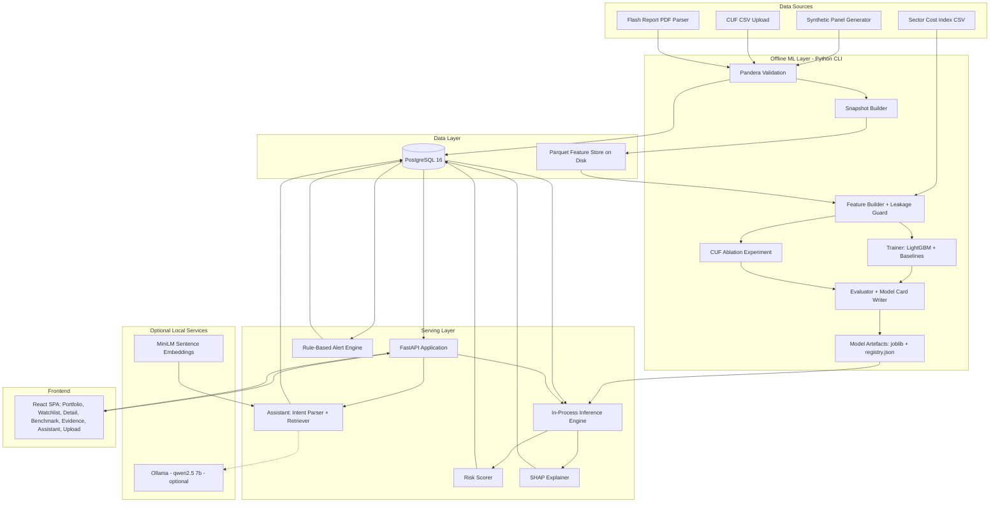
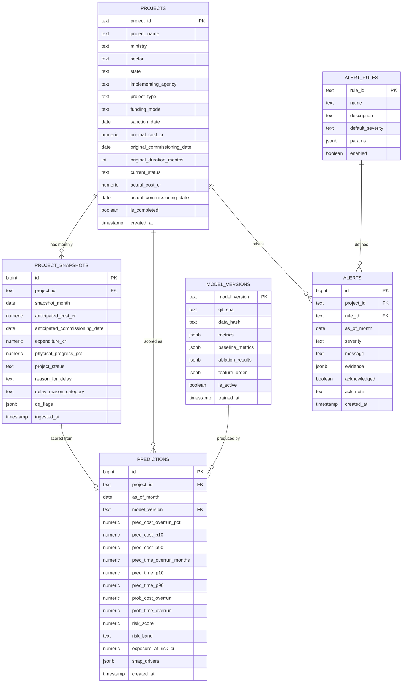

# Technical Approach — PAIMANA Predictive Analytics & Early Warning System (PEWS)

**Document type:** Implementation blueprint for an AI coding agent
**Target:** Buildable MVP / hackathon prototype (student team, laptop-class hardware, open-source only)
**Version:** 1.0
**Status:** Authoritative. If a requirement is ambiguous during implementation, use the assumptions recorded in this document rather than inventing new ones.

---

## 0. Critical Assumptions (read this first)

These assumptions were made because the information was not supplied. They are binding for the build.

| # | Assumption | Rationale | Impact if wrong |
|---|---|---|---|
| A1 | **The team does not have access to the live PAIMANA database or its API.** | No credentials, schema dump, or export was provided. PAIMANA is a government portal with role-based access. | High. Mitigated by A2/A3. |
| A2 | The only realistically obtainable *real* data is the MoSPI **Flash Report on Central Sector Projects (₹150 crore and above)**, published monthly as PDF/tabular reports, containing per-project rows: project name, ministry, sector, state, original cost, anticipated cost, original commissioning date, anticipated commissioning date, expenditure to date, physical progress %, and free-text reasons for delay. | This is the public face of the same underlying OCMS/PAIMANA data. | Medium. Parser is a Should-Have, not a Must-Have. |
| A3 | The MVP will be trained on a **schema-faithful synthetic panel dataset**, statistically calibrated to published PAIMANA aggregates, with a **real-data ingestion adapter** built to the same schema so real data can be swapped in with zero code change. | Only way to get labelled, month-by-month, ~20-year panel history without the real DB. | This is the single biggest credibility risk. See §19-R1 for the mitigation and the honesty rules. |
| A4 | The **Common Upload Form (CUF)** field list is not published. We define a concrete CUF-equivalent schema (§6.2) derived from the fields the problem statement explicitly names plus Flash Report columns. All "CUF vs non-CUF" analysis uses this definition. | Required to answer scope dimension (c). | Low. Schema is config-driven; swap the field list in `config/cuf_fields.yaml`. |
| A5 | Calibration anchors from the problem statement: 1,981 ongoing projects, 17 ministries, 22 sectors, original cost ₹37.13 lakh crore, revised cost ₹42.78 lakh crore (**aggregate cost overrun ≈ 15.2%**), expenditure ₹20.36 lakh crore (**≈ 47.6% of revised cost**). Historical completed-project pool assumed ≈ 6,000 projects since 2006. | Generator must reproduce these aggregates. | Low. |
| A6 | Hardware ceiling: one laptop, 8–16 GB RAM, CPU-only, no dedicated GPU guaranteed. Internet may be unreliable during the demo. | Standard hackathon reality. | Binding. No cloud GPU, no paid API, everything runs offline after `docker compose up`. |
| A7 | Currency displayed in ₹ crore. Dates handled at **month granularity** throughout (monitoring cadence is monthly). | Matches the monitoring cycle. | Low. |

---

## 1. Understanding the Problem

### 1.1 Problem being solved

MoSPI's IPMD monitors 1,981 ongoing central infrastructure projects worth ₹42.78 lakh crore. The current system (PAIMANA, previously OCMS) is **descriptive**: it records what already happened — the cost was revised, the date slipped, expenditure reached X%. By the time a cost revision or date slip appears in the portal, the overrun has *already occurred* and the money is already spent or committed. Intervention at that point is damage control, not prevention.

The problem is therefore **not** "we lack data" and **not** "we lack dashboards". It is: **the signal that a project is heading for trouble exists in the monthly data 6–18 months before the overrun is formally recorded, and nobody extracts it.**

### 1.2 Target users

| User | What they need | How often |
|---|---|---|
| **IPMD analyst (MoSPI)** — primary | A ranked watchlist of which of 1,981 projects to look at *this month*, with reasons. | Monthly, after data upload |
| **Ministry/Department project administrator** | Early warning on their own portfolio; comparison against sector peers. | Monthly |
| **Senior policymaker / Secretary** | Portfolio-level exposure: how much of ₹42.78 lakh crore is at risk, in which sectors. | Quarterly / on demand |
| **Implementing agency** | Which specific drivers are pushing their project's risk up. | On demand |

### 1.3 Current pain point

1. **Reactive, not predictive.** Overruns are reported after they crystallise.
2. **Attention does not scale.** 1,981 projects × ~40 fields × 12 months = ~950,000 data points per year. No analyst triages that manually; in practice attention goes to the biggest or the loudest projects, not the riskiest.
3. **No quantified risk.** "Delayed" is binary in the reports. There is no continuous, comparable risk score across sectors.
4. **Free-text delay reasons are unused.** Reasons like land acquisition, forest clearance, and contractor default sit as unstructured strings and are never aggregated into a driver analysis.
5. **No evidence about whether the CUF fields are even sufficient.** The Ministry does not know which additional fields would most improve prediction — so CUF cannot be improved on evidence.

### 1.4 Proposed solution (one sentence)

> A monthly batch scoring engine that takes each project's CUF snapshot as of month *t*, predicts the **final** cost overrun and time overrun that project will end up with, converts those into a calibrated 0–100 risk score plus deterministic rule-based alerts, and surfaces the result as a ranked watchlist with per-project SHAP explanations, sector benchmarking, and a natural-language assistant — with a formal benchmark proving whether ML beats conventional statistics and how much of the accuracy comes from CUF fields alone.

### 1.5 Core functionality

1. Ingest CUF-schema monthly project snapshots (CSV upload, synthetic generator, or Flash Report parser).
2. Build a leakage-safe panel feature store from those snapshots.
3. Train and version four model families: cost-overrun regressor, time-overrun regressor, overrun classifiers (early-warning triggers), and conventional statistical baselines.
4. Score all active projects each cycle; store predictions with prediction intervals.
5. Compute a composite risk score and fire rule-based alerts.
6. Explain each prediction (SHAP) and each alert (rule text).
7. Benchmark projects against sector/ministry/cost-band peer cohorts.
8. Aggregate global drivers of cost escalation.
9. Run and publish the **CUF-sufficiency ablation** and the **ML-vs-statistics benchmark**.
10. Answer natural-language questions over the scored portfolio.

### 1.6 Inputs

- **Bulk:** CSV of monthly project snapshots conforming to the CUF schema (§6.2).
- **Incremental:** one CSV per monitoring cycle (monthly upload).
- **Ad-hoc:** a single project JSON payload to `POST /api/predict` for what-if analysis.
- **Reference:** sector-wise WPI/construction-cost index CSV (bundled, static, offline).

### 1.7 Outputs

- Per-project: `predicted_cost_overrun_pct` with p10/p50/p90, `predicted_time_overrun_months` with p10/p50/p90, `p_cost_overrun` (calibrated probability), `p_time_overrun`, `risk_score` (0–100), `risk_band`, top-5 SHAP drivers with signed contributions, active alerts with rule IDs and plain-language text.
- Portfolio: total value at risk (₹ crore), risk distribution, sector heatmap, top-50 watchlist.
- Analytical: global driver ranking, peer benchmark tables, model evidence pack (metrics vs baselines, calibration curve, CUF ablation table, lead-time curve).

### 1.8 Constraints

- Open-source tools/software only. No paid APIs, no proprietary models, no cloud GPU.
- Must run end-to-end on a laptop, offline, after one command.
- Buildable by a student team in hackathon time.
- Must be technically credible — a real model actually trained on real numbers, not a UI that fakes it.

### 1.9 Success criteria

| Criterion | Target |
|---|---|
| End-to-end demo runs offline from `docker compose up` | Mandatory |
| Models genuinely trained, artefacts on disk, metrics reproducible via one command | Mandatory |
| Zero target leakage — verified by an automated test that fails the build | Mandatory |
| ML vs conventional statistics comparison table produced from a real experiment | Mandatory |
| CUF-only vs CUF+derived vs CUF+external ablation table produced from a real experiment | Mandatory |
| Classifier PR-AUC materially above base rate; calibrated (Brier < 0.20) | Target |
| Median early-warning lead time ≥ 6 months at Precision@50 ≥ 0.60 | Target |
| Cost overrun MAE ≤ 12 percentage points at mid-project (elapsed fraction ≈ 0.5) | Target |

### 1.10 What the MVP must prove

1. That a **forward-looking, as-of-month-t** prediction of *final* overrun is technically well-posed and can be made without leakage.
2. That the prediction arrives **early enough to act on** (measured lead time, not just accuracy).
3. That the ranked watchlist **concentrates real risk** at the top (Precision@50), which is the actual operational value.
4. That **gradient-boosted trees measurably beat OLS/actuarial baselines** — or, if they do not, to report that honestly, because dimension (b) of the problem statement asks a genuine question, not a rhetorical one.
5. That **CUF fields alone get you X% of the way**, and which additional fields close the remaining gap — an evidence-based recommendation for CUF v2.

### 1.11 "What exactly are we building?" — in plain technical terms

We are building a **tabular panel-data risk engine with a dashboard on top**.

Each project produces one row per monitoring month. For projects that have already finished, we know the answer: their final cost overrun and their final delay. So we take a finished project, rewind to month 12, hide everything that happened after month 12, and ask a gradient-boosting model: *given only what was visible at month 12, what did this project end up costing and when did it end up finishing?* We do that for every project and every month, producing hundreds of thousands of training examples. The model learns the fingerprint of a project that is quietly going wrong — physical progress flattening while expenditure keeps climbing, elapsed time outrunning progress, a sector and agency with a bad track record, a first date-revision already logged.

Then we point that trained model at the 1,981 projects that are still running, whose answers we do not yet know, and it tells us which ones look like the ones that went wrong. That ranking is the product.

Everything else — the score, the alerts, the SHAP explanations, the assistant — is presentation of that one prediction so a human can act on it.

---

## 2. MVP Scope

### 2.1 Must Have

| ID | Feature | Why it exists | What it does | How it is implemented |
|---|---|---|---|---|
| M1 | **CUF-schema data layer + synthetic panel generator** | Nothing can be built without labelled panel data (A1–A3). | Generates ~6,000 completed + ~2,000 ongoing projects, monthly snapshots, calibrated to A5 aggregates, with realistic latent shocks the model cannot observe. | `ml/data/generator.py` using NumPy; parameters in `config/generator.yaml`; writes Parquet + loads to Postgres. |
| M2 | **Leakage-safe snapshot/feature builder** | Target leakage is the #1 way this project fails silently. | Converts raw monthly rows into as-of-t feature vectors with an explicit blacklist of post-hoc fields, out-of-fold target encoding, and purged group-time splits. | `ml/features/builder.py` + `ml/features/leakage_guard.py`; DuckDB over Parquet. |
| M3 | **Cost overrun regressor + Time overrun regressor** | Outcomes (a) and (b) of the problem statement. | Predicts final cost overrun % and final delay in months from an as-of-t snapshot, with p10/p50/p90 via quantile objectives. | LightGBM (`objective=quantile` × 3 + `objective=l2`). |
| M4 | **Overrun classifiers (early-warning triggers)** | Ranking needs a calibrated probability, not a point estimate. | `p_cost_overrun` = P(final cost overrun > 10%), `p_time_overrun` = P(final delay > 6 months). | LightGBM binary + `CalibratedClassifierCV` (isotonic) on a held-out calibration fold. |
| M5 | **Conventional statistical baselines** | Scope dimension (b) explicitly asks whether AI/ML beats conventional methods. Without baselines the answer is unsupported. | Sector-median naive, OLS on log-cost with sector dummies, logistic regression, and a Weibull AFT survival model for schedule. | `statsmodels`, `scikit-learn`, `lifelines`. |
| M6 | **Composite risk scoring framework** | Outcome (c). Analysts need one comparable number across 22 heterogeneous sectors. | Deterministic, transparent, config-weighted 0–100 score with four bands. | `ml/scoring/risk_score.py`, weights in `config/scoring.yaml`. |
| M7 | **Rule-based alert engine** | ML alone is a black box and fails on unusual projects; deterministic rules are auditable and catch data-quality problems ML cannot. | Eight named rules (§11.4) evaluated per project per cycle, each producing a severity and a plain-language reason. | Pure Python rules module; no ML dependency. |
| M8 | **SHAP explanations** | An unexplained risk score will not be trusted by a government analyst and cannot justify an intervention. | Per-prediction top-5 signed drivers; global driver ranking. | `shap.TreeExplainer`, precomputed during batch scoring and stored as JSONB. |
| M9 | **FastAPI backend + Postgres** | Serving layer. | ~16 endpoints (§8), models loaded in-process at startup. | FastAPI, SQLAlchemy 2.0, Alembic, Pydantic v2. |
| M10 | **React dashboard: Portfolio, Watchlist, Project Detail** | Outcome (g). This is what gets demonstrated. | Three core screens covering the whole decision loop. | React 18 + Vite + TS + Tailwind + Recharts + TanStack Query. |
| M11 | **Model evidence page** | This is the differentiator. Most teams show a dashboard; few show proof the model is honest. | Renders the ML-vs-baseline table, CUF ablation table, calibration curve, lead-time curve, straight from `models/registry.json`. | Read-only screen fed by `GET /api/models/registry`. |
| M12 | **CUF-sufficiency ablation experiment** | Scope dimension (c), asked explicitly and almost always ignored. | Trains the same model on 3 nested feature sets and reports the delta. | `ml/experiments/ablation.py`, results committed to `models/registry.json`. |
| M13 | **Batch scoring job** | Monthly cycle is the operational reality. | Rescores every active project, writes predictions + alerts. | CLI `python -m ml.pipelines.score_all` + `POST /api/scoring/run`. |
| M14 | **Seeded demo state + reset** | A demo that requires a 10-minute training run on stage will fail. | `make demo` loads a pre-scored database in <60s. | SQL dump + committed model artefacts. |

### 2.2 Should Have

| ID | Feature | Why | What | How |
|---|---|---|---|---|
| S1 | **Benchmarking & comparative analytics** (outcome e) | Contextualises risk: 20% overrun is normal in one sector, alarming in another. | Peer cohort = same sector + cost band; percentile rank on 6 indicators. | SQL window functions; one endpoint + one screen. |
| S2 | **Cost escalation driver analysis** (outcome f) | Converts individual SHAP values into policy-level insight. | Aggregated mean absolute SHAP by feature group, sliced by sector/ministry. | Aggregation over stored SHAP JSONB. |
| S3 | **Delay-reason text classification** | Turns free text into a usable feature and a driver category. | Keyword+embedding classifier into 9 categories: land acquisition, forest/environment clearance, contractor/EPC, funds, litigation, R&R, ROW/utility shifting, statutory approvals, force majeure. | `sentence-transformers/all-MiniLM-L6-v2` (~80 MB, CPU) + a seeded keyword lexicon; kNN over labelled seeds. |
| S4 | **LLM Project Intelligence Assistant** (outcome h) | Explicitly named in the problem statement; makes the demo memorable. | NL question → structured query over scored data → grounded narrative answer. | **Two-tier:** deterministic intent parser + SQL templates always available; optional local Ollama (`qwen2.5:7b-instruct-q4`) for narrative phrasing when present. Never invents numbers — all figures come from the DB. |
| S5 | **CSV upload endpoint with validation report** | Demonstrates the monthly ingestion cycle live. | Validates against the CUF schema, returns a per-row error report, ingests valid rows. | Pandera schema validation. |
| S6 | **Flash Report PDF parser** | Path to real data. | Extracts project tables from MoSPI Flash Report PDFs into CUF CSV. | `pdfplumber` + column heuristics; explicitly best-effort. |
| S7 | **Alert acknowledgement workflow** | Shows the operational loop closing. | Analyst marks an alert acknowledged/actioned with a note. | One table, two endpoints. |

### 2.3 Future — DO NOT BUILD IN THE MVP

| Feature | Why excluded |
|---|---|
| Authentication, RBAC, SSO/NIC integration | Adds days of work, demonstrates nothing about the core idea. Demo runs as a single implicit analyst. |
| Live PAIMANA API integration | No credentials (A1). Adapter interface is defined; implementation is out of scope. |
| Deep learning sequence models (LSTM/Transformer/TFT) on the panel | ~400k rows of 40-column tabular data. GBDT will beat them and trains in seconds. Adding them costs GPU, time, and accuracy. |
| Spark / Hadoop / Kafka / Airflow | The full panel is ~120 MB. Pandas and DuckDB handle it comfortably. "Big Data Analytics" at this volume means columnar analytics, not a cluster. |
| Fine-tuning an LLM | See §5.7. There is no task here that fine-tuning solves. |
| Vector DB (Pinecone/Weaviate/Qdrant server) | The RAG corpus is ~2,000 short documents. A NumPy matrix with cosine similarity is faster and has zero infrastructure. |
| Kubernetes, Terraform, autoscaling, CI/CD pipelines | Production concerns, zero demo value. |
| Mobile app, email/SMS alert delivery | Nice-to-have wrapper around the same data. |
| Causal inference / counterfactual intervention modelling | Genuinely valuable and genuinely hard. Note it as a research direction, do not attempt it. |
| Multi-tenant ministry-scoped data isolation | Depends on auth, which is excluded. |

---

## 3. System Architecture

### 3.1 Diagram



### 3.2 Component-by-component justification

| Component | Why it is needed | Why not something else |
|---|---|---|
| **Synthetic Panel Generator** | Without labelled multi-year panel history there is no supervised learning problem at all (A1). | Real data would be better but is not obtainable. The generator is written to be *replaceable*, not permanent. |
| **Pandera validation** | Government data uploads are messy: missing dates, revised cost below original cost, progress > 100%. Silent corruption of the feature store is unrecoverable. | Manual `if` checks do not produce the per-row error report the upload screen needs. |
| **Snapshot Builder** | Converts an event/monthly log into the as-of-t supervised learning format. This transformation *is* the modelling insight. | Training directly on final-state rows is the trap that produces a 0.99 R² model with zero real value. |
| **Leakage Guard** | Enforces the blacklist and the split policy as executable code, not documentation. | Reviewer discipline is not reliable at 3 a.m. during a hackathon. |
| **LightGBM** | Best accuracy-per-minute on heterogeneous tabular data with missing values and high-cardinality categoricals; native categorical support; trains in seconds on CPU; TreeSHAP is exact and fast. | Neural nets need more data and tuning; RandomForest is weaker and larger; XGBoost is comparable but has clumsier categorical handling. |
| **Statistical baselines** | Mandated by dimension (b). Also protective: if OLS matches LightGBM, that is a finding, not a failure. | Skipping them makes the ML claim unfalsifiable. |
| **Rule engine (separate from ML)** | Catches data-quality failures and hard policy breaches that a regressor will smooth over; auditable; works on day one for a project with no history. | A single ML score cannot express "this project has not reported in 3 cycles". |
| **PostgreSQL** | Relational panel data with heavy filtering, ranking, and window-function benchmarking; JSONB for SHAP payloads; runs from one docker-compose line. | SQLite lacks JSONB indexing and concurrent write comfort; a document store buys nothing here. |
| **Parquet + DuckDB (offline only)** | Feature building scans the whole panel repeatedly; columnar files make this seconds instead of minutes, without an ETL service. | Doing feature engineering through the ORM would be slow and would tempt leakage via convenient joins. |
| **In-process inference** | ~1,981 predictions per cycle. Model artefact is ~5 MB. Loading it into the FastAPI process removes an entire network hop and an entire container. | TorchServe/BentoML/Triton are pure overhead at this scale. |
| **React + Vite** | The dashboard is the deliverable that gets judged; it needs real interactivity (filter, drill-down, chart hover). | Streamlit is faster to write but produces a demo that looks like a notebook and struggles with a 6-screen navigation model. |
| **Ollama (optional)** | Provides the LLM outcome (h) fully offline and free. | Any hosted LLM API violates the offline/free constraint and creates a demo-day network dependency. |
| **Structured logging (`structlog`) to stdout** | Enough observability to debug a live demo. | Prometheus/Grafana/ELK are production concerns (§16). |

---

## 4. Technology Stack

| Layer | Technology | Why |
|---|---|---|
| Frontend | **React 18 + Vite + TypeScript + Tailwind CSS + Recharts + TanStack Query** | Fast dev server, typed API contracts, Recharts covers every chart needed (line, bar, scatter, heatmap via custom cells), TanStack Query removes hand-rolled loading/error state. All MIT-licensed. |
| Backend | **Python 3.11 + FastAPI + Uvicorn + Pydantic v2** | Same language as the ML stack — no serialisation boundary between model and API. Auto-generated OpenAPI docs double as demo material. |
| AI/ML | **LightGBM 4.x, scikit-learn 1.5, SHAP 0.45, statsmodels 0.14, lifelines 0.28, pandas 2.x, NumPy, DuckDB 1.x** | Complete coverage: GBDT, calibration, explanations, OLS/logit baselines, survival baseline, columnar feature engineering. All pip-installable, CPU-only, Apache/BSD/MIT. |
| NLP (optional) | **sentence-transformers all-MiniLM-L6-v2** + **Ollama running qwen2.5:7b-instruct-q4** | MiniLM is 80 MB and runs on CPU in milliseconds. Ollama + a 4-bit 7B model runs on 8 GB RAM, fully offline, Apache 2.0. Both are strictly optional — the app degrades to templates. |
| Database | **PostgreSQL 16** + SQLAlchemy 2.0 + Alembic | JSONB for SHAP payloads, window functions for benchmarking, migrations for schema evolution. One container. |
| Feature store | **Parquet files on local disk, queried with DuckDB** | Zero infrastructure, columnar speed, trivially versioned by filename. |
| Model storage | **joblib artefacts in `models/` + `models/registry.json` model card** | Human-readable, git-friendly, no MLflow server to run. |
| Validation | **Pandera** | Declarative dataframe schemas that produce row-level error reports directly usable by the upload UI. |
| Testing | **pytest + pytest-cov + httpx + Vitest** | Standard; `httpx.AsyncClient` tests FastAPI without a running server. |
| Containerisation | **Docker + docker compose** | `docker compose up` starts Postgres, API, and web. Single reproducible demo command. |
| Task running | **Makefile** | `make setup`, `make data`, `make train`, `make score`, `make demo`, `make test`. |
| Logging | **structlog → stdout JSON** | Debuggable during a live demo; no external service. |

**Deliberately excluded:** Spark, Airflow, Kafka, Kubernetes, Redis, Celery, MLflow server, any vector database, any cloud service, any paid API. Each was considered and rejected as unnecessary at this data volume (§2.3).

---

## 5. AI/ML Technical Approach

### 5.1 The learning problem, stated precisely

For a project *p* observed at monitoring month *t*:

- **Feature vector** `x(p, t)` = everything knowable about *p* at the end of month *t*, and nothing else.
- **Targets** (known only for projects that have reached completion):
  - `y_cost(p) = (final_actual_cost − original_approved_cost) / original_approved_cost × 100` — final cost overrun, percent.
  - `y_time(p) = months_between(actual_commissioning_date, original_commissioning_date)` — final time overrun, months. Negative allowed (early completion).
  - `y_cost_flag(p) = 1 if y_cost > 10 else 0`
  - `y_time_flag(p) = 1 if y_time > 6 else 0`

Note that the target is a **project-level constant** while the features are **snapshot-level**. Each completed project contributes one training row per monitoring month it lived through. This is what makes ~6,000 completed projects into ~290,000 training rows, and it is also why naive random splitting is catastrophic (§7.2).

**Thresholds (10% cost, 6 months) are configurable** in `config/targets.yaml`. Defaults chosen to sit near the reported aggregate overrun (15.2%, A5) so classes are not degenerate; the trainer must log the realised base rate and warn if it falls outside 10–60%.

### 5.2 Models used, and why

| Model | Task | Algorithm | Justification |
|---|---|---|---|
| `cost_reg` | Final cost overrun % | LightGBM `objective=l2`, plus three `objective=quantile` models (α=0.1, 0.5, 0.9) for the interval | Non-linear interactions (sector × elapsed_frac × progress_gap) that a linear model cannot express; handles NaNs natively; quantile heads give an honest interval instead of a false point estimate |
| `time_reg` | Final delay in months | Same structure | Same |
| `cost_clf` | P(cost overrun > 10%) | LightGBM binary + isotonic calibration | Ranking requires a probability, and probabilities must be calibrated or the risk score is meaningless |
| `time_clf` | P(delay > 6 months) | Same | Same |
| `base_naive` | Baseline | Sector × cost-band median of historical overrun | The "what an analyst already knows" floor. If we cannot beat this, we have nothing |
| `base_ols` | Baseline | OLS on log(original_cost) + sector dummies + elapsed_frac + progress_gap | Conventional statistical method, dimension (b) |
| `base_logit` | Baseline | Logistic regression, same design matrix, standardised | Conventional classifier |
| `base_aft` | Baseline | Weibull Accelerated Failure Time (`lifelines`) on time-to-commissioning with right-censoring for ongoing projects | The methodologically correct classical treatment of schedule data; a strong and fair opponent |
| `delay_reason_clf` (S3) | Free text → 9 categories | MiniLM embeddings + kNN over ~90 seed phrases | No labelled corpus exists; few-shot embedding kNN needs none |

### 5.3 Input format

Feature vector, ~48 columns, assembled per (project_id, snapshot_month):

**Group C — CUF static (available at sanction)**
`sector` (cat, 22), `ministry` (cat, 17), `state` (cat), `original_cost_cr` (float, log-transformed), `log_original_cost`, `original_duration_months` (int), `sanction_year` (int), `implementing_agency` (cat), `funding_mode` (cat: budgetary / EBR / PPP / mixed), `project_type` (cat).

**Group C — CUF dynamic as-of-t**
`elapsed_months`, `elapsed_fraction` = elapsed / original_duration, `physical_progress_pct`, `expenditure_cr`, `financial_progress_pct` = expenditure / original_cost × 100, `current_status` (cat: ongoing / suspended / on-hold).

**Group D — Derived from CUF (no new fields collected)**
`progress_gap` = financial_progress − physical_progress, `schedule_perf_index` = physical_progress / (elapsed_fraction × 100), `cost_perf_index` = physical_progress / max(financial_progress, 1), `progress_velocity_3m` and `_6m` = mean monthly Δphysical_progress, `expenditure_velocity_3m`, `stall_months_3m` = count of months with Δprogress < 0.5pp, `months_since_update`, `n_date_revisions_to_date`, `n_cost_revisions_to_date`, `realized_cost_overrun_pct_to_date` (revisions already booked — *not* the final answer), `projected_completion_at_current_velocity`, `velocity_deficit` = required_velocity − actual_velocity, `is_first_slip_logged`.

**Group E — External / non-CUF enrichment**
`sector_cost_index_delta` (WPI-construction change since sanction, from bundled CSV), `agency_hist_mean_cost_overrun` and `agency_hist_mean_delay` (out-of-fold target encoding, training-window only), `sector_hist_mean_cost_overrun`, `state_hist_mean_delay`, `concurrent_agency_load` (count of other active projects by the same agency), `sanction_year_cohort_overrun`, `delay_reason_category` (S3), `n_distinct_delay_reasons`, `monsoon_exposure_months` (region-based construction-season proxy).

This C / D / E partition is not cosmetic — it is exactly the ablation partition required by scope dimension (c).

### 5.4 Output format

```json
{
  "project_id": "PRJ-004217",
  "as_of_month": "2026-04",
  "cost": { "point_pct": 23.4, "p10": 9.1, "p50": 22.8, "p90": 41.6, "prob_overrun_gt_10pct": 0.81 },
  "time": { "point_months": 14.2, "p10": 4.0, "p50": 13.5, "p90": 29.0, "prob_delay_gt_6m": 0.87 },
  "risk_score": 78.4,
  "risk_band": "CRITICAL",
  "exposure_at_risk_cr": 1284.6,
  "drivers": [
    { "feature": "progress_gap", "value": 27.4, "shap": 8.9, "direction": "increases",
      "text": "Expenditure is 27 percentage points ahead of physical progress." },
    { "feature": "stall_months_3m", "value": 3, "shap": 6.2, "direction": "increases",
      "text": "Physical progress has been flat for 3 consecutive months." }
  ],
  "alerts": [
    { "rule_id": "R1_PROGRESS_STALL", "severity": "HIGH",
      "message": "No measurable physical progress for 3 consecutive monitoring cycles." }
  ],
  "model_version": "pews-v1.0.3"
}
```

### 5.5 Preprocessing

1. Parse all dates to month-start `DATE`; drop day precision.
2. Coerce numerics; strip currency symbols and thousands separators from uploaded CSVs.
3. Clip `physical_progress_pct` to [0, 100]; log a data-quality flag when clipping occurs rather than silently fixing it.
4. **Missing data policy:**
   - Numeric predictive features → leave as `NaN`; LightGBM handles missingness natively and can learn from the pattern. **Do not impute.** For the OLS/logit baselines only, median-impute inside a `Pipeline` fitted on training folds.
   - Categoricals → explicit `"UNKNOWN"` level.
   - `physical_progress_pct` missing → forward-fill from the previous snapshot for up to 3 months, then `NaN`, and set `months_since_update` accordingly. The staleness is itself signal.
   - A project missing `original_cost_cr` or `original_commissioning_date` is **rejected at validation**, not imputed — those are identity fields.
5. High-cardinality categoricals (`implementing_agency`, `state`) → LightGBM native categorical for the tree models; out-of-fold target encoding for the historical-prior features in Group E.
6. Winsorise `y_cost` at the 1st/99th percentile before regression training to stop a handful of 400%-overrun outliers dominating the loss. **Do not winsorise the classification labels or the evaluation set** — those extreme projects are precisely the ones we need to catch.

### 5.6 Training process

```
1. Load raw monthly panel from Parquet.
2. Build snapshots: for each completed project, emit one row per monitoring month,
   attach the project-level final targets.
3. Apply the leakage guard (blacklist + assertions). Abort on any violation.
4. Split (§7.2): purged group-time split. Group = project_id. Time = sanction cohort.
   Train = projects completed before 2021-01. Validation = 2021-01 to 2023-06.
   Test = completed after 2023-06. Ongoing projects are inference-only.
5. Fit out-of-fold target encoders on TRAIN ONLY; transform val/test with train statistics.
6. Train LightGBM with early stopping on the validation split.
7. Calibrate classifiers with isotonic regression on the validation split.
8. Train all five baselines on the identical splits and feature matrix.
9. Run the CUF ablation: retrain the same config on {C}, {C+D}, {C+D+E}.
10. Evaluate everything on TEST, once. Write models/registry.json.
11. Persist artefacts with joblib; record the git SHA, feature list order, and data hash.
```

**LightGBM hyperparameters** (fixed, tuned by a small `RandomizedSearchCV` over 30 candidates on the validation split; final values written to the model card):

```yaml
regression:
  objective: regression_l2
  n_estimators: 800
  learning_rate: 0.05
  num_leaves: 63
  max_depth: 8
  min_child_samples: 80        # high: snapshots within a project are correlated
  subsample: 0.8
  subsample_freq: 1
  colsample_bytree: 0.8
  reg_alpha: 0.1
  reg_lambda: 1.0
  early_stopping_rounds: 60
classification:
  objective: binary
  is_unbalance: true
  n_estimators: 600
  learning_rate: 0.05
  num_leaves: 31
  min_child_samples: 100
  early_stopping_rounds: 50
quantile:
  objective: quantile
  alpha: [0.1, 0.5, 0.9]
  n_estimators: 600
  learning_rate: 0.05
```

`min_child_samples` is set unusually high on purpose: adjacent monthly snapshots of the same project are near-duplicates, and low leaf minimums let the model memorise individual projects.

### 5.7 Why we are NOT fine-tuning an LLM

Stating this explicitly because the problem statement lists LLMs and the default reflex is to reach for one.

1. The core task is **numeric prediction from ~48 structured tabular features**. LLMs are markedly worse than GBDTs at this, slower by orders of magnitude, and cannot produce a calibrated probability or an exact SHAP attribution.
2. There is **no labelled instruction dataset** to fine-tune on. Building one would consume the entire hackathon and produce a model worse than a 200 KB LightGBM file.
3. Fine-tuning needs a GPU, violating A6.
4. The only genuine language tasks are (i) classifying short free-text delay reasons and (ii) phrasing answers. (i) is solved by an 80 MB embedding model with few-shot kNN. (ii) is solved by templates, optionally polished by an off-the-shelf local model.

**What we use instead:** LightGBM for prediction, MiniLM embeddings for text categorisation, and an optional off-the-shelf local LLM strictly as a *narrator over retrieved facts*. The assistant is never permitted to produce a number; every figure in its answer is interpolated from a database query result. This is enforced in code by building the answer from a structured result object.

### 5.8 Inference process

At scoring time the pipeline is identical to training except that snapshots come from *ongoing* projects at their latest month:

```
load latest snapshot per active project
  → apply the same feature builder (shared code path, not a reimplementation)
  → apply persisted encoders
  → assert feature name/order matches models/registry.json.feature_order
  → predict: cost_reg, cost_q10/50/90, time_reg, time_q10/50/90, cost_clf, time_clf
  → TreeSHAP on the two classifiers
  → risk score
  → rule engine
  → upsert into predictions and alerts
```

Cost: ~1,981 projects × ~8 model calls ≈ under 3 seconds total on a laptop CPU, SHAP included.

### 5.9 Model storage and versioning

```
models/
├── registry.json                 # model card: versions, metrics, baselines, ablation, feature order, data hash, git SHA
├── v1.0.3/
│   ├── cost_reg.joblib
│   ├── cost_q10.joblib  cost_q50.joblib  cost_q90.joblib
│   ├── time_reg.joblib  time_q10.joblib  time_q50.joblib  time_q90.joblib
│   ├── cost_clf_calibrated.joblib
│   ├── time_clf_calibrated.joblib
│   ├── encoders.joblib
│   ├── feature_order.json
│   └── metrics.json
└── baselines/  (naive.joblib, ols.pkl, logit.joblib, aft.pkl)
```

The API loads `registry.json → active_version` at startup and fails loudly if any artefact is missing.

### 5.10 Retraining strategy

Monthly, after the new cycle's data lands, on a rolling 10-year window. The new model becomes champion only if it beats the incumbent on the frozen test set by ≥2% relative PR-AUC; otherwise the incumbent is retained and a warning is logged. **In the MVP this is a documented CLI command (`make retrain`), not a scheduler.**

---

## 6. Data Pipeline

### 6.1 Flow

```
Raw monthly CUF rows  (generator | CSV upload | Flash Report parser)
        ↓
Pandera schema validation  → rejected rows + error report (never silently dropped)
        ↓
Normalisation  (dates to month-start, currency to ₹ crore, categorical canonicalisation)
        ↓
Persist raw panel  → PostgreSQL project_snapshots  +  Parquet mirror
        ↓
Snapshot expansion  (project × month → as-of-t rows, targets joined only for completed projects)
        ↓
Feature builder  (Groups C, D, E)  +  LEAKAGE GUARD  ← build fails here if violated
        ↓
        ├── completed projects → train / validation / test  (purged group-time split)
        └── ongoing projects   → inference matrix
        ↓
LightGBM + baselines → artefacts + registry.json
        ↓
Batch scoring → predictions (point, p10/p50/p90, probabilities) + SHAP JSONB
        ↓
Risk scoring + rule engine → risk_score, risk_band, alerts
        ↓
PostgreSQL
        ↓
FastAPI (filter, rank, aggregate, benchmark, explain)
        ↓
React dashboard
```

### 6.2 CUF-equivalent schema (assumption A4 — this is the contract)

`data/schemas/cuf_snapshot.csv` — one row per project per monitoring month.

| Field | Type | Required | Notes |
|---|---|---|---|
| `project_id` | string | ✅ | Stable identifier |
| `project_name` | string | ✅ | |
| `ministry` | string | ✅ | One of 17 |
| `sector` | string | ✅ | One of 22 |
| `state` | string | ✅ | `"MULTI"` for inter-state |
| `implementing_agency` | string | ✅ | |
| `project_type` | string | ❌ | greenfield / brownfield / expansion |
| `funding_mode` | string | ❌ | budgetary / EBR / PPP / mixed |
| `sanction_date` | date | ✅ | Month precision |
| `original_cost_cr` | float | ✅ | ₹ crore, > 150 |
| `original_commissioning_date` | date | ✅ | |
| `snapshot_month` | date | ✅ | Month of this report |
| `anticipated_cost_cr` | float | ❌ | Latest revised cost |
| `anticipated_commissioning_date` | date | ❌ | Latest revised date |
| `expenditure_cr` | float | ✅ | Cumulative |
| `physical_progress_pct` | float | ✅ | 0–100 |
| `project_status` | string | ✅ | ongoing / completed / suspended / on-hold |
| `reason_for_delay` | text | ❌ | Free text |
| `actual_cost_cr` | float | ❌ | **Populated only when status = completed** |
| `actual_commissioning_date` | date | ❌ | **Populated only when status = completed** |

The last two are the label source and are the primary leakage hazard.

### 6.3 Validation rules (Pandera)

| Rule | Action on failure |
|---|---|
| Required field null | Reject row, report |
| `original_cost_cr` < 150 | Reject (out of monitoring scope) |
| `physical_progress_pct` outside [0, 100] | Clip, set `dq_flag_progress_clipped` |
| `expenditure_cr` > 2 × `anticipated_cost_cr` | Accept, set `dq_flag_expenditure_anomaly` |
| `anticipated_commissioning_date` < `sanction_date` | Reject |
| `snapshot_month` < `sanction_date` | Reject |
| Duplicate `(project_id, snapshot_month)` | Keep last, log |
| `status = completed` but `actual_cost_cr` null | Reject — unlabelable |
| Unknown `sector` / `ministry` | Map to `"OTHER"`, log |

### 6.4 New data entry

`POST /api/projects/upload` (multipart CSV) → validate → returns `{accepted, rejected, errors[]}` → accepted rows upserted → user triggers `POST /api/scoring/run` → dashboard refreshes. This is the live monthly cycle demonstrated in §15.5.

---

## 7. Training vs Validation vs Testing vs Inference

### 7.1 What each stage is

| Stage | Data | Purpose |
|---|---|---|
| **Training** | Snapshots of projects **completed before 2021-01** (~60% of completed projects, ~175k rows) | Fit LightGBM trees, OLS coefficients, AFT parameters, and target encoders |
| **Validation** | Snapshots of projects completed **2021-01 → 2023-06** (~20%, ~58k rows) | Early stopping, hyperparameter selection, probability calibration. Touched many times |
| **Testing** | Snapshots of projects completed **after 2023-06** (~20%, ~58k rows) | Evaluated **once**, at the end, for the reported numbers. Never used for any decision |
| **Inference** | Latest snapshot of each **ongoing** project (1,981 rows). No labels exist | Production scoring |

### 7.2 Leakage prevention — the most important section in this document

There are **four distinct leakage channels** in this problem. All four must be closed, and each has an automated test.

**Channel 1 — Target leakage through post-hoc fields.**
`actual_cost_cr`, `actual_commissioning_date`, and `project_status = completed` encode the answer. Additionally, `anticipated_cost_cr` and `anticipated_commissioning_date` from months *after t* encode most of it.
→ **Guard:** an explicit blacklist in `ml/features/leakage_guard.py`. `assert_no_blacklisted_columns(X)` runs before every `fit()` and every `predict()`. A snapshot at month *t* may only reference raw rows with `snapshot_month <= t`.

**Channel 2 — Group leakage across snapshots.**
A random 80/20 split puts month 11 of project P in train and month 12 of project P in test. Those rows are ~99% identical and share the same label. Reported R² approaches 0.99 and means nothing.
→ **Guard:** all splits are grouped by `project_id`. `assert_disjoint_projects(train, val, test)` fails the build otherwise.

**Channel 3 — Temporal leakage / look-ahead.**
Training on 2024 projects to "predict" 2019 outcomes uses knowledge of later cost-escalation regimes. Sector-level target encodings computed over the whole dataset leak future outcomes into past rows.
→ **Guard:** split by completion cohort, not at random. All Group-E historical priors are computed **only from the training window**, out-of-fold, and applied unchanged to val/test.

**Channel 4 — Survivorship / censoring bias.**
Training only on completed projects biases toward projects that actually finished. The worst projects — abandoned, indefinitely stalled — never appear as labelled examples, so the model systematically under-predicts extreme risk.
→ **Mitigation (partial, and stated as a limitation):** (i) the Weibull AFT baseline explicitly models right-censored ongoing projects; (ii) projects stalled for >24 months are labelled with a censored-at-current-state pseudo-target and flagged; (iii) the model card documents that predictions are conditional on eventual completion. This bias cannot be fully removed and the report must say so.

### 7.3 Automated leakage tests (must exist, must be in CI)

```python
def test_blacklist_enforced():
    X, _ = build_features(panel)
    assert not set(X.columns) & set(BLACKLIST)

def test_project_disjoint_splits():
    tr, va, te = make_splits(snapshots)
    assert not (set(tr.project_id) & set(va.project_id))
    assert not (set(tr.project_id) & set(te.project_id))
    assert not (set(va.project_id) & set(te.project_id))

def test_no_future_rows_in_snapshot():
    snap = build_snapshot(project_rows, as_of="2020-06")
    assert snap.source_max_month <= pd.Timestamp("2020-06-01")

def test_target_encoding_uses_train_only():
    enc = fit_target_encoder(train)
    assert enc.n_source_rows == len(train)

def test_shuffled_label_gives_no_skill():
    # Sanity check: permuted labels must collapse performance to chance.
    m = train_model(X_train, shuffle(y_train))
    assert roc_auc_score(y_test, m.predict_proba(X_test)[:, 1]) < 0.60
```

The last test is the strongest single defence: if a model trained on shuffled labels still scores well on the test set, there is leakage somewhere and the build must fail.

### 7.4 Inference at run time

A user opens a project. The API returns the stored prediction from the last batch score (fast path). If the user edits an assumption on the what-if panel, `POST /api/predict` builds the feature vector on the fly through the *same* `build_features()` code path and returns a fresh prediction. There is exactly one feature-building implementation; training/serving skew is prevented by construction, not by discipline.

---

## 8. Backend / API Design

### 8.1 Endpoints

| Method | Endpoint | Purpose | Input | Output |
|---|---|---|---|---|
| GET | `/api/health` | Liveness + model version | — | `{status, model_version, db, n_projects}` |
| POST | `/api/projects/upload` | Ingest CUF CSV | multipart file | `{accepted, rejected, errors[]}` |
| GET | `/api/projects` | Filterable, sortable, paginated list | `sector, ministry, state, risk_band, min_cost, sort, page, size` | `{items[], total, page}` |
| GET | `/api/projects/{id}` | Full project record + latest prediction | path id | `ProjectDetail` |
| GET | `/api/projects/{id}/timeline` | Monthly history for charts | path id | `{months[], physical[], financial[], risk[], events[]}` |
| GET | `/api/projects/{id}/explanation` | SHAP drivers | path id | `{drivers[], base_value}` |
| GET | `/api/projects/{id}/peers` | Peer cohort comparison | path id | `{cohort_def, percentiles{}, peers[]}` |
| POST | `/api/predict` | Ad-hoc / what-if scoring | `CUFSnapshot` JSON | `PredictionResponse` |
| GET | `/api/alerts` | Alert feed | `severity, rule_id, ack, page` | `{items[], total}` |
| POST | `/api/alerts/{id}/ack` | Acknowledge alert | `{note}` | `{ok, alert}` |
| GET | `/api/analytics/portfolio` | Headline KPIs | `ministry?, sector?` | `{n_projects, total_cost_cr, value_at_risk_cr, band_counts{}, sector_heatmap[]}` |
| GET | `/api/analytics/benchmark` | Sector/ministry comparison | `dimension, metric` | `{rows[]}` |
| GET | `/api/analytics/drivers` | Global escalation drivers | `sector?, ministry?` | `{drivers[]}` |
| GET | `/api/analytics/watchlist` | Top-N ranked risk | `n=50, weight_by_exposure` | `{items[]}` |
| POST | `/api/scoring/run` | Trigger batch rescore | `{force?}` | `{scored, alerts_created, duration_s}` |
| POST | `/api/assistant/query` | NL question over portfolio | `{question, context?}` | `{answer, cited_project_ids[], sql_used, mode}` |
| GET | `/api/models/registry` | Model card, metrics, baselines, ablation | — | `ModelCard` |

### 8.2 Example — `GET /api/analytics/watchlist?n=3`

```json
{
  "generated_at": "2026-05-02T09:14:00Z",
  "model_version": "pews-v1.0.3",
  "items": [
    {
      "project_id": "PRJ-004217",
      "project_name": "Doubling of Rail Line Section-IV",
      "ministry": "Ministry of Railways",
      "sector": "Railways",
      "original_cost_cr": 3120.0,
      "physical_progress_pct": 41.0,
      "elapsed_fraction": 0.86,
      "risk_score": 78.4,
      "risk_band": "CRITICAL",
      "predicted_cost_overrun_pct": 23.4,
      "predicted_time_overrun_months": 14.2,
      "exposure_at_risk_cr": 1284.6,
      "top_driver": "Expenditure 27pp ahead of physical progress",
      "active_alerts": 2
    }
  ],
  "total_value_at_risk_cr": 4821.9
}
```

### 8.3 Example — `POST /api/predict`

Request:
```json
{
  "sector": "Roads",
  "ministry": "MoRTH",
  "state": "Gujarat",
  "implementing_agency": "NHAI",
  "funding_mode": "budgetary",
  "sanction_date": "2022-04-01",
  "original_cost_cr": 890.0,
  "original_commissioning_date": "2026-03-01",
  "snapshot_month": "2026-04-01",
  "expenditure_cr": 610.0,
  "physical_progress_pct": 48.0,
  "anticipated_cost_cr": 890.0,
  "reason_for_delay": "Land acquisition pending in 3 villages"
}
```

Response:
```json
{
  "cost": { "point_pct": 18.7, "p10": 6.2, "p50": 17.9, "p90": 34.1, "prob_overrun_gt_10pct": 0.74 },
  "time": { "point_months": 11.5, "p10": 3.0, "p50": 11.0, "p90": 23.0, "prob_delay_gt_6m": 0.79 },
  "risk_score": 71.2,
  "risk_band": "HIGH",
  "drivers": [
    { "feature": "progress_gap", "value": 20.5, "shap": 7.4, "direction": "increases",
      "text": "68.5% of budget spent against 48% physical progress." },
    { "feature": "elapsed_fraction", "value": 1.02, "shap": 6.1, "direction": "increases",
      "text": "Original schedule has fully elapsed with 52% of work remaining." },
    { "feature": "delay_reason_category", "value": "land_acquisition", "shap": 3.3, "direction": "increases",
      "text": "Land acquisition delays historically add 9 months in this sector." }
  ],
  "alerts": [
    { "rule_id": "R3_SCHEDULE_EXHAUSTED", "severity": "HIGH",
      "message": "Original timeline elapsed with physical progress below 60%." }
  ],
  "model_version": "pews-v1.0.3",
  "warnings": []
}
```

### 8.4 Cross-cutting backend concerns

- **Validation:** Pydantic v2 models on every request body; 422 with field-level detail. CSV uploads go through Pandera and return a row-indexed error list rather than a single failure.
- **Error handling:** a single exception middleware maps `ProjectNotFound → 404`, `ValidationError → 422`, `ModelNotLoadedError → 503`, `FeatureMismatchError → 500` with the mismatching feature names logged. Every response carries an `X-Request-ID`.
- **Model loading:** on FastAPI `lifespan` startup, load `registry.json` and all artefacts into `app.state.models`; if any artefact is missing, refuse to start and print the exact `make train` command needed.
- **Feature/serving skew:** `predict` asserts `list(X.columns) == registry.feature_order` and raises `FeatureMismatchError` otherwise.
- **Auth:** none in the MVP (§2.3). A `get_current_user()` dependency stub returning a fixed analyst identity is included so auth can be added later without touching route signatures.
- **Concurrency:** `POST /api/scoring/run` takes an advisory lock so two concurrent runs cannot interleave writes.

---

## 9. Database Design

### 9.1 ER diagram



### 9.2 Table purposes and key constraints

| Table | Purpose | Notes |
|---|---|---|
| `projects` | One immutable row per project; identity and final outcome | `actual_*` columns are NULL for ongoing projects and are **never** read by the feature builder — enforced by the leakage guard |
| `project_snapshots` | The monthly panel; the raw material for everything | `UNIQUE(project_id, snapshot_month)`; index on `(project_id, snapshot_month DESC)` |
| `predictions` | Latest and historical scores; keeping history enables the risk-trajectory chart and lead-time measurement | `UNIQUE(project_id, as_of_month, model_version)`; index on `(risk_score DESC)` for the watchlist |
| `alert_rules` | Rule definitions as data so thresholds are tunable without a redeploy | Seeded by migration |
| `alerts` | Fired alerts with evidence payload | `UNIQUE(project_id, rule_id, as_of_month)` — prevents duplicate firing per cycle |
| `model_versions` | The model card, queryable | Feeds the Evidence screen directly; exactly one row with `is_active = true` |

Six tables. Nothing else is needed for the MVP.

---

## 10. Frontend / User Flow

### 10.1 Primary user journey

```
Analyst opens dashboard
→ Portfolio Overview loads: 1,981 projects, ₹42.78 lakh crore, 214 CRITICAL, ₹3.1 lakh crore at risk
→ Sector heatmap shows Railways and Urban Development are the hot cells
→ Analyst clicks "Watchlist"
→ Top-50 table, ranked by risk score, exposure-weighting toggle on
→ Row 1: PRJ-004217, risk 78.4, predicted +23.4% cost, +14.2 months
→ Analyst clicks the row
→ Project Detail: progress-vs-expenditure divergence chart, risk trajectory over 18 months
  showing the score crossed 60 in Nov 2024 — eleven months before the first official date revision
→ SHAP waterfall: progress gap, stalled velocity, land-acquisition reason
→ Peer panel: 91st percentile risk within Railways / ₹1000-5000 cr cohort
→ Analyst opens the Assistant: "Which railway projects have stalled for 3+ months?"
→ Grounded answer with 7 cited project IDs, each clickable
→ Analyst acknowledges the alert with a note
→ Analyst opens the Evidence page and shows the judges that LightGBM beats OLS by 0.11 PR-AUC
  and that CUF-only features reach 82% of the full model's PR-AUC
```

### 10.2 Screens

| # | Screen | Purpose | Inputs / Actions | API calls | Displays | Loading / Error |
|---|---|---|---|---|---|---|
| 1 | **Portfolio Overview** (`/`) | Executive answer to "how bad is it?" | Ministry & sector filters | `/analytics/portfolio`, `/analytics/drivers` | 5 KPI cards, risk-band donut, sector×risk heatmap, top-10 drivers bar | Skeleton cards; banner + retry on error |
| 2 | **Watchlist** (`/watchlist`) | The operational deliverable | Filters, exposure-weight toggle, top-N slider, CSV export, row click | `/analytics/watchlist`, `/alerts` | Ranked table: rank, name, sector, cost, progress, risk score chip, predicted overruns, exposure, alert count | Skeleton rows; empty state |
| 3 | **Project Detail** (`/project/:id`) | Understand and justify one project | Tabs, what-if sliders (cost, progress), acknowledge alert | `/projects/{id}`, `/timeline`, `/explanation`, `/peers`, `/predict` (what-if), `/alerts/{id}/ack` | Header with risk gauge; dual-axis progress/expenditure chart; risk trajectory line; prediction card with p10–p90 band; SHAP waterfall; alert list; peer percentile bars | Per-panel spinners; 404 page for unknown id |
| 4 | **Benchmarking** (`/benchmark`) | Comparative analytics (S1) | Dimension selector (sector/ministry/state/cost band), metric selector | `/analytics/benchmark` | Sorted bar chart + table: mean predicted overrun, mean delay, % critical, value at risk | Standard |
| 5 | **Model Evidence** (`/evidence`) | Prove the model is honest — the differentiator | Read-only | `/models/registry` | ML-vs-baselines table, CUF ablation table (C / C+D / C+D+E), calibration curve, lead-time-vs-precision curve, feature list, data hash, limitations text | Standard |
| 6 | **Assistant** (`/assistant`) | LLM outcome (h) | Free-text question, suggested-question chips | `/assistant/query` | Answer with inline clickable project chips; a "how this was answered" disclosure showing the executed query | Streaming/typing state; graceful "LLM unavailable, showing structured answer" fallback |
| 7 | **Data Upload** (`/upload`) | Demonstrate the monthly cycle | File picker, "Run scoring" button | `/projects/upload`, `/scoring/run` | Accepted/rejected counts, row-level error table, scoring progress, link to refreshed watchlist | Progress bar; per-row error display |

### 10.3 Shared components

`RiskBadge`, `KPICard`, `SHAPWaterfall`, `PredictionInterval` (p10–p90 band), `ProjectTable`, `AlertChip`, `EmptyState`, `ErrorBoundary`, `LoadingSkeleton`.

**Risk band colours:** LOW 0–25 green `#16a34a`, WATCH 25–50 amber `#ca8a04`, HIGH 50–75 orange `#ea580c`, CRITICAL 75–100 red `#dc2626`. Bands are always accompanied by the text label — never colour alone.

---

## 11. Core Algorithms and Logic

### 11.1 Snapshot construction (the central transformation)

```python
def build_snapshots(project_rows, min_elapsed_months=3, stride=1):
    """
    project_rows: monthly rows for ONE project, sorted ascending by snapshot_month.
    Emits one training/inference row per eligible month, using ONLY rows <= t.
    """
    out = []
    for i, row_t in enumerate(project_rows):
        elapsed = months_between(project_rows[0].sanction_date, row_t.snapshot_month)
        if elapsed < min_elapsed_months:
            continue                       # too little history to compute velocity
        if i % stride != 0:
            continue                       # optional downsampling of correlated rows

        history = project_rows[: i + 1]    # <-- the leakage boundary. Nothing after i.
        feats = {}
        feats.update(static_cuf_features(project_rows[0]))
        feats.update(dynamic_cuf_features(row_t, elapsed))
        feats.update(derived_features(history))
        feats.update(external_features(row_t, history))
        feats["as_of_month"] = row_t.snapshot_month
        feats["source_max_month"] = history[-1].snapshot_month   # asserted in tests

        if project_is_completed(project_rows):
            feats["y_cost"] = final_cost_overrun_pct(project_rows)
            feats["y_time"] = final_delay_months(project_rows)
            feats["y_cost_flag"] = int(feats["y_cost"] > COST_THRESHOLD_PCT)
            feats["y_time_flag"] = int(feats["y_time"] > TIME_THRESHOLD_MONTHS)
        out.append(feats)
    return out
```

### 11.2 Key derived features

```python
def derived_features(history):
    t = history[-1]
    elapsed  = months_between(history[0].sanction_date, t.snapshot_month)
    planned  = history[0].original_duration_months
    frac     = elapsed / max(planned, 1)

    fin_prog = 100.0 * t.expenditure_cr / max(history[0].original_cost_cr, 1e-6)
    phy_prog = t.physical_progress_pct

    last3 = history[-4:] if len(history) >= 4 else history
    vel3  = (last3[-1].physical_progress_pct - last3[0].physical_progress_pct) \
            / max(len(last3) - 1, 1)

    remaining_months = max(planned - elapsed, 0)
    required_vel = (100.0 - phy_prog) / max(remaining_months, 1)

    return {
        "elapsed_fraction":     frac,
        "financial_progress_pct": fin_prog,
        "progress_gap":         fin_prog - phy_prog,          # >0 = spending outruns delivery
        "schedule_perf_index":  phy_prog / max(frac * 100.0, 1e-6),
        "cost_perf_index":      phy_prog / max(fin_prog, 1e-6),
        "progress_velocity_3m": vel3,
        "velocity_deficit":     required_vel - vel3,           # >0 = cannot finish on time
        "stall_months_3m":      count_stalled_months(last3, threshold_pp=0.5),
        "n_date_revisions":     count_distinct_changes(history, "anticipated_commissioning_date"),
        "n_cost_revisions":     count_distinct_changes(history, "anticipated_cost_cr"),
        "realized_overrun_pct": 100.0 * (t.anticipated_cost_cr - history[0].original_cost_cr)
                                / max(history[0].original_cost_cr, 1e-6),
        "months_since_update":  months_since_last_progress_change(history),
    }
```

`velocity_deficit` and `progress_gap` are expected to be the two strongest single features. If they are not, that is a signal to investigate the generator before trusting the model.

### 11.3 Risk scoring

```python
# config/scoring.yaml
# weights: {p_cost: 0.30, p_time: 0.30, severity: 0.20, momentum: 0.20}
# bands:   {LOW: [0,25], WATCH: [25,50], HIGH: [50,75], CRITICAL: [75,100]}

def compute_risk_score(pred, feats, cfg):
    w = cfg["weights"]

    # 1. Calibrated probabilities, already in [0,1].
    p_cost = pred["prob_cost_overrun"]
    p_time = pred["prob_time_overrun"]

    # 2. Severity: how bad if it happens. Normalised with a saturating curve so that
    #    a 300% overrun does not simply pin every score at 100.
    sev_cost = min(max(pred["pred_cost_overrun_pct"], 0) / 50.0, 1.0)
    sev_time = min(max(pred["pred_time_overrun_months"], 0) / 36.0, 1.0)
    severity = 0.5 * sev_cost + 0.5 * sev_time

    # 3. Momentum: is it deteriorating right now? Rule-based, no ML.
    momentum = clamp01(
        0.35 * (feats["stall_months_3m"] / 3.0)
      + 0.35 * clamp01(feats["velocity_deficit"] / 2.0)
      + 0.20 * clamp01(feats["n_date_revisions"] / 3.0)
      + 0.10 * clamp01(feats["months_since_update"] / 3.0)
    )

    score = 100.0 * (w["p_cost"] * p_cost + w["p_time"] * p_time
                     + w["severity"] * severity + w["momentum"] * momentum)

    # 4. Hard floor: any CRITICAL-severity rule alert forces at least HIGH.
    if any(a["severity"] == "CRITICAL" for a in pred["alerts"]):
        score = max(score, 75.0)

    return round(min(score, 100.0), 1), band_for(score, cfg["bands"])


def exposure_at_risk_cr(project, pred):
    """Rupees at risk = remaining commitment x probability x expected severity.
    Used to rank by *money*, not just by probability, which is what a
    Secretary actually cares about."""
    remaining = max(project.original_cost_cr - project.expenditure_cr, 0)
    expected_extra = project.original_cost_cr * max(pred["pred_cost_overrun_pct"], 0) / 100.0
    return round((remaining + expected_extra) * pred["prob_cost_overrun"], 1)
```

**Design note:** the risk score is deliberately *not* a model output. It is a transparent weighted combination of model outputs and rule signals, with weights in a config file. A government analyst can be shown exactly why a score is 78.4, and the Ministry can retune the weights without retraining anything.

### 11.4 Alert rules

| Rule ID | Condition | Severity | Message |
|---|---|---|---|
| `R1_PROGRESS_STALL` | `stall_months_3m >= 3` | HIGH | No measurable physical progress for 3 consecutive cycles |
| `R2_SPEND_AHEAD_OF_WORK` | `progress_gap > 20` | HIGH | Expenditure exceeds physical progress by more than 20 percentage points |
| `R3_SCHEDULE_EXHAUSTED` | `elapsed_fraction > 0.8 and physical_progress < 60` | HIGH | Original timeline nearly elapsed with major work outstanding |
| `R4_REPEATED_SLIPPAGE` | `n_date_revisions >= 2` | MEDIUM | Completion date revised two or more times |
| `R5_COST_ALREADY_REVISED` | `realized_overrun_pct > 10` | MEDIUM | Approved cost already exceeded by more than 10 percent |
| `R6_STALE_REPORTING` | `months_since_update >= 2` | MEDIUM | No progress update for two or more monitoring cycles (data quality) |
| `R7_VELOCITY_INFEASIBLE` | `velocity_deficit > 2.0 and elapsed_fraction > 0.5` | CRITICAL | At current pace the project cannot complete within any reasonable extension |
| `R8_HIGH_EXPOSURE_CRITICAL` | `risk_band == CRITICAL and original_cost_cr > 1000` | CRITICAL | Large-value project in critical risk band |

Rules run **independently of the ML models**, so the system still produces useful output if a model artefact fails to load. Each fired alert stores an `evidence` JSONB payload with the exact feature values that triggered it.

### 11.5 Assistant flow (S4)

```python
def answer(question, db, llm=None):
    # 1. Deterministic intent classification: 8 intents, keyword + embedding kNN.
    intent, slots = parse_intent(question)     # e.g. TOP_RISK, SECTOR_SUMMARY, PROJECT_LOOKUP,
                                               # STALLED_PROJECTS, DRIVER_QUERY, COMPARE, COUNT, UNKNOWN

    if intent == "UNKNOWN":
        return fallback_with_suggestions()

    # 2. Execute a PARAMETERISED SQL TEMPLATE. Never generated SQL. Never free-form.
    rows = SQL_TEMPLATES[intent].execute(db, **slots)

    # 3. Build a factual answer from the rows using a template. This always works.
    answer_text = TEMPLATES[intent].render(rows)

    # 4. Optional polish. The LLM receives ONLY the retrieved rows and is instructed
    #    to rephrase without introducing or altering any number.
    if llm is not None and llm.available():
        answer_text = llm.rephrase(answer_text, rows, temperature=0.2)
        answer_text = verify_numbers_unchanged(answer_text, rows)   # reject and fall back on mismatch

    return {"answer": answer_text,
            "cited_project_ids": [r.project_id for r in rows],
            "sql_used": SQL_TEMPLATES[intent].sql,
            "mode": "llm" if llm else "template"}
```

The `verify_numbers_unchanged` check is not optional. It extracts every numeric token from the generated text and requires each to appear in the retrieved rows; if not, the template answer is returned instead. This makes hallucinated figures structurally impossible.

### 11.6 Early-warning lead time (the headline evaluation metric)

```python
def lead_time_months(project_snapshots_with_scores, threshold=50.0):
    """How many months before the FIRST OFFICIAL SIGNAL did the model flag this project?
    Official signal = first anticipated-date revision or first anticipated-cost revision.
    This is the number that demonstrates the system's actual value."""
    first_alert = first_month_where(project_snapshots_with_scores, lambda s: s.risk_score >= threshold)
    first_official = first_month_of_official_revision(project_snapshots_with_scores)
    if first_alert is None or first_official is None:
        return None
    return months_between(first_alert, first_official)   # positive = we warned early
```

Report the **median lead time over correctly-flagged, genuinely-overrun test projects**, at a fixed operating point (Precision@50 ≥ 0.60). A model with 0.85 AUC and 1-month lead time is worthless; a model with 0.75 AUC and 9-month lead time is transformative. Lead time is the primary metric.

---

## 12. Project Folder Structure

```text
paimana-pews/
├── README.md                       # quickstart, architecture, demo script
├── Makefile                        # setup, data, train, score, demo, test, retrain
├── docker-compose.yml              # postgres + api + web (+ optional ollama profile)
├── .env.example                    # ALL configuration; never commit .env
│
├── config/
│   ├── generator.yaml              # synthetic data parameters, calibration anchors
│   ├── cuf_fields.yaml             # the CUF field list (assumption A4) - swap for real CUF
│   ├── features.yaml               # feature groups C / D / E for the ablation
│   ├── targets.yaml                # overrun thresholds
│   ├── scoring.yaml                # risk weights and bands
│   └── model.yaml                  # LightGBM hyperparameters
│
├── data/
│   ├── raw/                        # generated or ingested CSV (gitignored)
│   ├── processed/                  # Parquet panel + feature store (gitignored)
│   ├── reference/
│   │   ├── sector_cost_index.csv   # WPI-construction proxy, committed
│   │   ├── sectors.csv             # the 22 sectors
│   │   └── ministries.csv          # the 17 ministries
│   ├── seeds/
│   │   └── delay_reason_seeds.csv  # ~90 labelled phrases for S3
│   └── demo/
│       └── demo_dump.sql           # pre-scored DB for the 60-second demo
│
├── ml/
│   ├── data/
│   │   ├── generator.py            # synthetic panel generator
│   │   ├── flash_report_parser.py  # (S6) MoSPI PDF -> CUF CSV
│   │   └── validate.py             # Pandera schemas
│   ├── features/
│   │   ├── builder.py              # THE single feature-building code path
│   │   ├── snapshots.py            # snapshot expansion
│   │   ├── encoders.py             # out-of-fold target encoding
│   │   └── leakage_guard.py        # blacklist + split assertions
│   ├── models/
│   │   ├── train.py                # LightGBM trainer
│   │   ├── baselines.py            # naive, OLS, logit, Weibull AFT
│   │   ├── calibrate.py            # isotonic calibration
│   │   └── explain.py              # TreeSHAP wrappers
│   ├── experiments/
│   │   ├── ablation.py             # CUF-sufficiency study (dimension c)
│   │   ├── benchmark.py            # ML vs statistics (dimension b)
│   │   └── lead_time.py            # early-warning lead-time analysis
│   ├── scoring/
│   │   ├── risk_score.py
│   │   └── rules.py                # the 8 alert rules
│   ├── nlp/
│   │   ├── delay_reason.py         # (S3) embedding kNN classifier
│   │   └── assistant.py            # (S4) intent parser + SQL templates + optional LLM
│   ├── pipelines/
│   │   ├── build_dataset.py
│   │   ├── train_all.py
│   │   └── score_all.py            # batch scoring entrypoint
│   └── evaluate.py                 # writes models/registry.json
│
├── models/                         # artefacts + registry.json (COMMITTED, needed for demo)
│
├── backend/
│   ├── app/
│   │   ├── main.py                 # FastAPI app + lifespan model loading
│   │   ├── config.py               # pydantic-settings, reads .env
│   │   ├── db.py                   # engine, session
│   │   ├── models_orm.py           # SQLAlchemy models
│   │   ├── schemas.py              # Pydantic request/response
│   │   ├── deps.py                 # DI: db session, loaded models
│   │   ├── errors.py               # exception middleware
│   │   ├── routers/
│   │   │   ├── health.py  projects.py  predict.py
│   │   │   ├── alerts.py  analytics.py  scoring.py
│   │   │   ├── assistant.py  registry.py
│   │   └── services/
│   │       ├── inference.py        # loads artefacts, calls ml.features.builder
│   │       ├── ingest.py           # CSV upload handling
│   │       └── benchmark.py        # peer-cohort SQL
│   ├── alembic/                    # migrations + rule seed data
│   ├── tests/
│   └── requirements.txt
│
├── frontend/
│   ├── src/
│   │   ├── pages/                  # Portfolio, Watchlist, ProjectDetail, Benchmark,
│   │   │                           # Evidence, Assistant, Upload
│   │   ├── components/             # RiskBadge, KPICard, SHAPWaterfall, ProjectTable, ...
│   │   ├── api/                    # typed client, TanStack Query hooks
│   │   ├── types/                  # generated from the OpenAPI schema
│   │   └── lib/                    # formatters: ₹ crore, month labels, colours
│   ├── package.json
│   └── vite.config.ts
│
├── tests/
│   ├── test_leakage.py             # MUST PASS - see §7.3
│   ├── test_features.py
│   ├── test_scoring.py
│   ├── test_rules.py
│   ├── test_api.py
│   └── test_e2e.py
│
├── scripts/
│   ├── seed_demo.sh                # loads demo_dump.sql
│   └── reset_demo.sh
│
└── docs/
    ├── ARCHITECTURE.md
    ├── MODEL_CARD.md               # generated, includes limitations
    └── DEMO_SCRIPT.md              # the 5-minute walkthrough
```

---

## 13. Implementation Plan

### Phase 1 — Project Setup

| | |
|---|---|
| **Tasks** | Init repo; `docker-compose.yml` (postgres:16, api, web); `.env.example`; `Makefile`; Python 3.11 venv + `requirements.txt`; Vite React TS scaffold; pre-commit with ruff + black; empty pytest suite that runs green |
| **Files** | `docker-compose.yml`, `Makefile`, `.env.example`, `backend/requirements.txt`, `frontend/package.json`, `backend/app/main.py` (health only) |
| **Depends on** | — |
| **Output** | `docker compose up` starts Postgres and a FastAPI app answering `GET /api/health` |
| **Done when** | `curl localhost:8000/api/health` returns 200 and `npm run dev` serves a page that calls it successfully |

### Phase 2 — Data Layer

| | |
|---|---|
| **Tasks** | Write `config/cuf_fields.yaml`, `config/generator.yaml`; implement `ml/data/generator.py`; implement `ml/data/validate.py` (Pandera); write Alembic migrations for all 6 tables + seed the 8 alert rules; `ml/pipelines/build_dataset.py` to generate → validate → load Postgres → write Parquet |
| **Files** | `ml/data/generator.py`, `ml/data/validate.py`, `backend/alembic/versions/*`, `data/reference/*.csv` |
| **Depends on** | Phase 1 |
| **Output** | ~8,000 projects and ~380,000 snapshot rows in Postgres and Parquet |
| **Done when** | `make data` completes; aggregate cost overrun of the generated ongoing portfolio is within ±2pp of 15.2% (A5) and expenditure ratio within ±3pp of 47.6%; a test asserts this |

**Generator requirements (do not skip these — they determine whether the model is meaningful):**
- Latent per-project variables the model **cannot observe**: `true_complexity`, `agency_capability`, `land_acquisition_burden`, `political_priority`. Outcomes depend on these; features only see their noisy downstream effects. Without unobservables the model reaches an unrealistic ~0.97 AUC and the whole evaluation becomes meaningless.
- Sector-specific base rates for overrun and delay drawn from plausible ranges (Railways and Urban Development worse; Petroleum and Telecom better).
- Regime shift: projects sanctioned after 2020 have a different cost-escalation distribution, so the temporal test split is genuinely hard.
- Realistic missingness: 5–12% of monthly snapshots missing or stale.
- Right-censoring: ~4% of projects stall permanently and never complete.
- Monotonic non-decreasing cumulative expenditure and physical progress with occasional flat runs.

### Phase 3 — AI/ML

| | |
|---|---|
| **Tasks** | `snapshots.py`; `builder.py` with feature groups C/D/E; **`leakage_guard.py` and `tests/test_leakage.py` FIRST, before any training code**; `encoders.py`; `train.py`; `baselines.py`; `calibrate.py`; `explain.py`; `ablation.py`; `benchmark.py`; `lead_time.py`; `evaluate.py` writing `models/registry.json` |
| **Files** | Everything under `ml/features/`, `ml/models/`, `ml/experiments/` |
| **Depends on** | Phase 2 |
| **Output** | Trained artefacts in `models/v1.0.0/`, a populated `registry.json` with real metrics, baselines, and ablation results |
| **Done when** | `make train` runs end to end in under 10 minutes on a laptop; all five leakage tests pass; the shuffled-label test yields AUC < 0.60; `registry.json` contains non-placeholder numbers for LightGBM, all four baselines, and all three ablation configurations |

> **Hard rule:** write `test_leakage.py` before `train.py`. If training code exists first, the temptation to relax the guard to make training run is overwhelming, and the entire project's credibility depends on that guard.

### Phase 4 — Backend

| | |
|---|---|
| **Tasks** | SQLAlchemy ORM models; Pydantic schemas; `inference.py` service loading artefacts at lifespan startup; all 17 routers; `risk_score.py` and `rules.py` wired into `score_all.py`; exception middleware; `ingest.py` for CSV upload; benchmark SQL |
| **Files** | `backend/app/**`, `ml/scoring/*`, `ml/pipelines/score_all.py` |
| **Depends on** | Phase 3 |
| **Output** | Every endpoint in §8.1 responding with real data |
| **Done when** | `make score` populates `predictions` and `alerts` for all ongoing projects in under 30 seconds; `/docs` renders the full OpenAPI schema; `pytest backend/tests` passes |

### Phase 5 — Frontend

| | |
|---|---|
| **Tasks** | Typed API client generated from OpenAPI; TanStack Query hooks; shared components; the 7 screens in §10.2; routing; loading skeletons and error boundaries; ₹ crore / lakh crore formatters |
| **Files** | `frontend/src/**` |
| **Depends on** | Phase 4 |
| **Output** | Full dashboard against the live API |
| **Done when** | All 7 screens render real data; a judge can go Portfolio → Watchlist → Project Detail → SHAP → acknowledge alert without a console error |

### Phase 6 — Integration

| | |
|---|---|
| **Tasks** | S3 delay-reason classifier wired into the feature builder and driver analysis; S4 assistant (templates first, Ollama behind a feature flag); S5 upload → score → refresh loop; S1 benchmarking screen; S6 Flash Report parser (time permitting); generate `models/registry.json`-driven Evidence page |
| **Files** | `ml/nlp/*`, `frontend/src/pages/Assistant.tsx`, `Upload.tsx`, `Benchmark.tsx` |
| **Depends on** | Phase 5 |
| **Output** | All Should-Have features working or explicitly disabled by flag |
| **Done when** | Assistant answers all 8 intents correctly with the LLM container stopped (template mode), and again with it running |

### Phase 7 — Testing

| | |
|---|---|
| **Tasks** | Complete the test matrix in §17; run the full ML evaluation and paste real numbers into `MODEL_CARD.md`; edge-case handling; verify all `X` acceptance thresholds or document the miss honestly |
| **Files** | `tests/**`, `docs/MODEL_CARD.md` |
| **Depends on** | Phase 6 |
| **Output** | Green suite, honest model card |
| **Done when** | `make test` passes; coverage on `ml/features` and `ml/scoring` ≥ 80%; the E2E test drives upload → score → watchlist → detail |

### Phase 8 — Demo

| | |
|---|---|
| **Tasks** | Produce `data/demo/demo_dump.sql` from a fully scored database; `scripts/seed_demo.sh`; `make demo`; write `docs/DEMO_SCRIPT.md` with the exact 5-minute narration and the exact project IDs to click; hand-pick 3 demo projects that tell a clear story; verify the whole thing with WiFi off |
| **Files** | `data/demo/demo_dump.sql`, `scripts/*.sh`, `docs/DEMO_SCRIPT.md`, `README.md` |
| **Depends on** | Phase 7 |
| **Output** | A demo that starts in under 60 seconds on a cold laptop |
| **Done when** | On a machine that has never run the project: `git clone && make demo` produces a working dashboard with pre-scored data, with networking disabled |

---

# 14. Instructions for the Coding Agent

**Read this section before writing any code, and re-read it before declaring the build complete.**

### Non-negotiable rules

1. **Build the MVP first.** Complete every Must-Have (M1–M14) before starting any Should-Have. Never start a Future item.
2. **Write `ml/features/leakage_guard.py` and `tests/test_leakage.py` before `ml/models/train.py`.** Not after. Not alongside. Before.
3. **There is exactly one feature-building code path.** `ml/features/builder.py` is used by training, batch scoring, and the live `/api/predict` endpoint. Never write a second implementation "just for inference."
4. **Never read `actual_cost_cr`, `actual_commissioning_date`, or any post-`t` snapshot inside a feature function.** These are label-only fields. The blacklist in `leakage_guard.py` is authoritative.
5. **Follow the architecture in §3 and the stack in §4 exactly.** If you believe a different choice is better, add a `DEVIATION:` comment in the file explaining the reason and note it in the README. Do not silently substitute.
6. **All configuration lives in `config/*.yaml` and `.env`.** Never hardcode: thresholds, risk weights, DB URLs, model paths, ports, LLM hosts, file paths.
7. **Never hardcode secrets or credentials.** `.env.example` is committed; `.env` is gitignored. There should be no secrets in this project anyway — flag it as a bug if you find yourself needing one.
8. **All numbers shown to the user must come from the database or a model.** Never hardcode a metric, a KPI, a chart series, or a prediction in the frontend. If a real value is not yet available, render an explicit `EmptyState`, not a fake number.
9. **The assistant may never state a number that did not come from a SQL result.** Implement `verify_numbers_unchanged()` (§11.5) and make it reject rather than pass through.
10. **Every model artefact must be produced by a real training run.** No pickled random weights, no stubbed `predict()`. If training fails, fix training.
11. **Keep components modular:** `ml/` must not import from `backend/app/`. `backend/app/` may import from `ml/`. The frontend talks only to the API.
12. **Handle errors explicitly.** Every endpoint has a defined failure mode. Every frontend query has a loading state and an error state. No blank screens, no unhandled promise rejections.
13. **Mark placeholders as `# TODO(pews):`** with a short reason, and list every one of them in the README under "Known gaps." Never leave a silent stub.
14. **Write tests for:** the leakage guard (5 tests, §7.3), the risk scoring function, each of the 8 alert rules, CSV validation, and the E2E flow. Aim for correctness of critical logic, not coverage percentage theatre.
15. **The application must run locally with documented commands** and must work with networking disabled once seeded.
16. **When something in this document is ambiguous, use the assumptions in §0.** Do not stop and ask. Do not invent a new assumption without recording it in the README.
17. **When the data is unavailable, generate it (§Phase 2) — never fabricate results.** Synthetic *input* data is legitimate and documented. Synthetic *metrics* are fraud.
18. **The prototype must demonstrate the real technical core.** A dashboard wired to hardcoded JSON fails this specification completely, regardless of how good it looks.

### Recommended build order

`Phase 1 → 2 → 3 → 4 → 5 → 6 → 7 → 8`, and inside Phase 3, strictly: `leakage tests → snapshots → features → baselines → LightGBM → calibration → SHAP → ablation → evaluate`. Baselines before LightGBM, so that there is always a working end-to-end pipeline even if GBDT tuning goes badly.

### Definition of done for the whole build

Every box in §21 is ticked, `make test` is green, and `make demo` works on a clean machine with WiFi off.

---

# 15. Prototype / Demo Technical Approach

### 15.1 What is real

| Component | Real? | Detail |
|---|---|---|
| Feature engineering | **Real** | The full snapshot-expansion and leakage-guard pipeline, exactly as it would run on real data |
| Model training | **Real** | LightGBM genuinely trained on ~290k rows; artefacts on disk; reproducible via `make train` |
| Statistical baselines | **Real** | OLS, logit, Weibull AFT genuinely fitted, genuinely compared |
| CUF ablation | **Real** | Three genuine training runs on nested feature sets |
| Calibration | **Real** | Isotonic regression fitted on a held-out fold; calibration curve plotted from test data |
| SHAP explanations | **Real** | TreeSHAP on the actual trained models |
| Risk score and alerts | **Real** | Computed live from model outputs and features |
| Backend, database, API | **Real** | Full Postgres schema and FastAPI service |
| Frontend | **Real** | Every number fetched from the API |
| Delay-reason classification | **Real** | MiniLM embeddings, few-shot kNN over seeded phrases |
| Batch scoring pipeline | **Real** | Runs on demand during the demo |

### 15.2 What is mocked or simplified

| Component | Status | Honest framing for the judges |
|---|---|---|
| **The project data itself** | **Synthetic**, schema-faithful, calibrated to published PAIMANA aggregates | "We do not have access to the PAIMANA database. We generated a statistically calibrated panel matching the published aggregates and built a real-data adapter so the same pipeline runs on the real CUF export with a config change." Say this out loud in the first 30 seconds. |
| Live PAIMANA API | **Not implemented** | Interface defined, adapter stubbed |
| Authentication | **Not implemented** | Single implicit analyst; auth dependency stub in place |
| LLM narration | **Optional** | Works fully in template mode; Ollama enabled if available |
| Flash Report PDF parser | **Best-effort** | Demonstrated on 1–2 real report pages if time allows |
| Alert delivery (email/SMS) | **Not implemented** | Alerts are in-app only |
| Scheduled monthly retraining | **CLI command only** | No scheduler |

### 15.3 Data, model, and training for the demo

- **Data:** ~8,000 projects (~6,000 completed, ~2,000 ongoing), ~380,000 monthly snapshots, ~120 MB Parquet, ~250 MB in Postgres.
- **Model:** LightGBM, ~5 MB of artefacts total, committed to the repo.
- **Training:** **real, not simulated.** Full training takes 4–8 minutes on a laptop CPU. For the demo, artefacts are pre-trained and committed so nothing waits on stage — but `make train` is shown as reproducible and the model card records the git SHA and data hash.
- **Runs locally:** everything. Postgres, API, frontend, models, embeddings, and optionally Ollama.
- **External APIs:** **none.** Zero network calls at run time.

### 15.4 Hardcoded vs configurable

| Hardcoded for the demo (acceptable) | Must remain configurable |
|---|---|
| The 3 hero project IDs in `DEMO_SCRIPT.md` | Overrun thresholds (`config/targets.yaml`) |
| Suggested-question chips on the Assistant screen | Risk weights and bands (`config/scoring.yaml`) |
| Sector and ministry reference lists | Alert rule thresholds (`alert_rules.params`, DB) |
| Risk band colour palette | LightGBM hyperparameters (`config/model.yaml`) |
| Default page size of 25 | CUF field list (`config/cuf_fields.yaml`) |
| | DB URL, API URL, LLM host (`.env`) |
| | Feature group membership (`config/features.yaml`) |

### 15.5 End-to-end demo scenario (5 minutes)

```
[0:00] Framing — 30 seconds
  "1,981 projects, ₹42.78 lakh crore, already ₹5.65 lakh crore over original cost.
   PAIMANA tells you that AFTER it happens. We predict it before."
  State the synthetic-data caveat immediately and move on.

[0:30] Portfolio Overview
  KPIs: 1,981 projects | ₹42.78 lakh crore | 214 CRITICAL | ₹3.1 lakh crore exposure at risk.
  Sector heatmap: Railways and Urban Development light up red.

[1:15] Watchlist
  Top-50 ranked. Toggle "weight by exposure" — the ranking reorders live, because
  a 60%-risk ₹5,000 crore project matters more than an 80%-risk ₹200 crore one.
  Click PRJ-004217.

[2:00] Project Detail — THE MOMENT
  Chart 1: expenditure climbing while physical progress flattens from month 14.
  Chart 2: risk trajectory. The score crossed 60 in Nov 2024.
  Overlay marker: the first OFFICIAL date revision was logged Oct 2025.
  "Eleven months of warning. That is the entire product."
  SHAP waterfall: progress gap +8.9, stalled velocity +6.2, land acquisition +3.3.
  Peer panel: 91st percentile of risk within its Railways / ₹1000-5000 cr cohort.

[3:00] Live scoring cycle
  Go to Upload. Drop next month's CUF CSV. Validation report: 1,974 accepted, 7 rejected
  with reasons. Click "Run scoring." 1,981 projects rescored in ~3 seconds.
  Return to Watchlist — three new projects have entered the critical band.

[3:45] Assistant
  "Which railway projects have stalled for three or more months?"
  Grounded answer, 7 clickable project chips, expandable "how this was answered" panel
  showing the executed SQL. Emphasise: the model cannot invent a number.

[4:15] Model Evidence — the section that separates this from a dashboard
  Table 1: LightGBM PR-AUC 0.78 vs Weibull AFT 0.69 vs OLS 0.64 vs sector median 0.52.
           "AI/ML does provide a measurable gain — here is the number, and here is the baseline
            we had to beat. Dimension (b) of the problem statement, answered with an experiment."
  Table 2: CUF-only 0.64 → +derived 0.74 → +external 0.78.
           "82% of achievable performance comes from fields the CUF already collects.
            The remaining gain needs agency workload history and land-acquisition status —
            that is our concrete recommendation for CUF v2. Dimension (c), answered."
  Calibration curve, lead-time curve, and the limitations section, read aloud.

[5:00] Close on the limitations slide. Owning the synthetic-data constraint openly
       is more persuasive than hoping nobody asks.
```

### 15.6 What must NOT be done in the demo

- Do not claim the data is real PAIMANA data.
- Do not show a metric that was not produced by `make train`.
- Do not train live on stage.
- Do not depend on the network for anything.
- Do not present the risk score as a black-box output — always open the SHAP panel.

---

## 16. Prototype vs Production

| Component | Prototype | Production |
|---|---|---|
| **Data source** | Synthetic calibrated panel + CSV upload | Direct PAIMANA DB replica or authenticated API pull on the monthly cycle |
| **Data volume** | ~8k projects, ~380k snapshots, ~120 MB | ~20 years of OCMS + PAIMANA history; still small (< 10 GB) — no cluster needed even in production |
| **Model** | Single global LightGBM per target | Per-sector-family models where volume allows; champion/challenger with automatic rollback; drift monitoring on feature distributions |
| **Labels** | Complete for synthetic history | Right-censoring is real and material; survival models become primary, not baseline |
| **Training** | Manual `make train` | Monthly automated retrain with a frozen benchmark set and a promotion gate |
| **Infrastructure** | docker compose on a laptop | NIC/MeghRaj hosting, containerised, two app replicas behind a load balancer. Still no GPU required |
| **Database** | Single Postgres container, no backups | Managed Postgres with PITR backups, read replica for analytics, partitioning on `snapshot_month` |
| **Security** | None | NIC SSO, role-based access mirroring PAIMANA roles, ministry-scoped row-level security, full audit log of who saw which project's risk score, TLS everywhere |
| **Privacy** | Not applicable (synthetic) | Project data is officially sensitive pre-publication. Risk scores about a ministry's projects are politically consequential and need access control and a defined disclosure policy |
| **Monitoring** | structlog to stdout | Prometheus metrics, alerting on scoring-job failure, data-freshness alarms, model-drift dashboards, prediction-vs-outcome tracking |
| **Explainability** | SHAP on demand | Same, plus a documented model card, a published methodology note, and a formal appeal route for a ministry that disputes a score |
| **Human-in-the-loop** | Alert acknowledgement only | Full workflow: assign, escalate, record intervention, and measure whether the intervention changed the outcome — which also generates the feedback data to improve the model |
| **Scaling** | Single process, 3-second full rescore | Even at 10× the projects, a single process suffices. The scaling problem here is organisational, not computational |

---

## 17. Testing Strategy

### 17.1 Test matrix

| Layer | Framework | Coverage target |
|---|---|---|
| ML unit | pytest | Features, snapshots, encoders, scoring, rules — ≥ 80% |
| **Leakage** | pytest | **100%, build-breaking** |
| API | pytest + httpx | Every endpoint: happy path + one failure path |
| Frontend unit | Vitest | Formatters, RiskBadge, SHAPWaterfall |
| E2E | pytest | Upload → validate → score → watchlist → detail |
| ML evaluation | custom | The full metric suite in §17.4 |

### 17.2 Concrete unit test cases

```python
# Features
test_elapsed_fraction_at_original_completion_is_one()
test_progress_gap_positive_when_spending_outruns_work()
test_velocity_zero_when_progress_flat()
test_velocity_deficit_negative_when_ahead_of_schedule()
test_missing_progress_forward_filled_max_three_months_then_nan()
test_months_since_update_increments_on_stale_rows()

# Scoring
test_risk_score_bounded_zero_to_hundred()
test_risk_score_monotonic_in_p_cost()             # raising p_cost never lowers the score
test_critical_alert_forces_minimum_score_75()
test_band_boundaries_exact()                       # 25.0 -> WATCH, 24.9 -> LOW
test_exposure_at_risk_zero_when_fully_spent_and_no_predicted_overrun()

# Rules — one per rule
test_R1_fires_on_three_flat_months()
test_R1_does_not_fire_on_two_flat_months()
test_R2_fires_at_gap_20_1_not_at_19_9()
test_R7_critical_when_velocity_infeasible_past_halfway()
test_R6_fires_on_stale_data_regardless_of_model_availability()

# Validation
test_rejects_project_below_150_crore()
test_rejects_completed_project_without_actual_cost()
test_clips_progress_above_100_and_sets_dq_flag()
test_duplicate_project_month_keeps_last_and_logs()
```

### 17.3 API and E2E tests

```python
def test_predict_returns_full_payload(client):
    r = client.post("/api/predict", json=VALID_SNAPSHOT)
    assert r.status_code == 200
    b = r.json()
    assert 0 <= b["risk_score"] <= 100
    assert b["cost"]["p10"] <= b["cost"]["p50"] <= b["cost"]["p90"]
    assert len(b["drivers"]) <= 5

def test_predict_rejects_missing_required_field(client):
    payload = {k: v for k, v in VALID_SNAPSHOT.items() if k != "original_cost_cr"}
    assert client.post("/api/predict", json=payload).status_code == 422

def test_watchlist_sorted_descending_by_risk(client):
    items = client.get("/api/analytics/watchlist?n=50").json()["items"]
    assert items == sorted(items, key=lambda x: -x["risk_score"])

def test_api_returns_503_when_models_missing(client_without_artifacts):
    assert client_without_artifacts.post("/api/predict", json=VALID_SNAPSHOT).status_code == 503

def test_e2e_upload_score_watchlist(client, sample_csv):
    up = client.post("/api/projects/upload", files={"file": sample_csv}).json()
    assert up["accepted"] > 0
    sc = client.post("/api/scoring/run", json={}).json()
    assert sc["scored"] == up["accepted"]
    wl = client.get("/api/analytics/watchlist?n=10").json()
    assert len(wl["items"]) > 0
    pid = wl["items"][0]["project_id"]
    assert client.get(f"/api/projects/{pid}/explanation").json()["drivers"]
```

### 17.4 ML evaluation metrics and acceptance criteria

| Model | Metric | Prototype acceptance |
|---|---|---|
| `cost_clf` | PR-AUC | ≥ 0.65 (base rate ≈ 0.35) |
| `cost_clf` | ROC-AUC | ≥ 0.75 |
| `cost_clf` | Brier score | ≤ 0.20 |
| `cost_clf` | Precision@50 | ≥ 0.60 |
| `time_clf` | PR-AUC | ≥ 0.65 |
| `cost_reg` | MAE at elapsed_fraction ≈ 0.5 | ≤ 12 percentage points |
| `cost_reg` | p10–p90 empirical coverage | 75–85% (nominal 80%) |
| `time_reg` | MAE at elapsed_fraction ≈ 0.5 | ≤ 6 months |
| Early warning | Median lead time at Precision@50 ≥ 0.60 | ≥ 6 months |
| **All models** | **Shuffled-label AUC** | **< 0.60 — build fails otherwise** |

**Slice reporting is mandatory.** Report every metric separately for elapsed_fraction buckets [0–0.33], [0.33–0.66], [0.66–1.0]. Accuracy at 90% elapsed is nearly worthless operationally; accuracy at 30% elapsed is the whole point. A model card that reports only the pooled number is hiding the important result.

### 17.5 Edge and failure cases to handle explicitly

| Case | Required behaviour |
|---|---|
| Project with only 1 monthly snapshot | Velocity features `NaN`; rules R1/R7 suppressed; prediction returned with `warnings: ["insufficient_history"]` |
| `physical_progress_pct = 100` but status still ongoing | Fires R6 (data quality); risk score capped at WATCH |
| `original_duration_months = 0` | Rejected at validation |
| Project already past `anticipated_commissioning_date` | `elapsed_fraction > 1`; features must not divide by zero |
| Sector never seen in training | LightGBM handles the unknown category; log a warning; add `unseen_category` to `warnings` |
| Empty CSV upload | 422 with a clear message, not a 500 |
| Malformed dates (`31-02-2024`) | Row rejected with the exact field named |
| All 1,981 projects in one sector after filtering | Benchmark endpoint returns single-cohort percentiles without crashing |
| Model artefact missing at startup | App refuses to start and prints the `make train` command |
| Ollama unavailable | Assistant silently falls back to template mode and reports `mode: "template"` |
| Two concurrent `POST /scoring/run` | Second call returns 409 (advisory lock held) |

---

## 18. Performance and Resource Requirements

| Resource | Requirement | Notes |
|---|---|---|
| **CPU** | 4 cores minimum, 8 recommended | LightGBM parallelises across cores |
| **RAM** | 8 GB minimum, 16 GB comfortable | Peak is the feature-matrix build (~380k × 48 float64 ≈ 150 MB); the LLM is the real driver if enabled |
| **GPU** | **None required** | Nothing in the critical path uses a GPU |
| **Disk** | ~3 GB | Postgres ~250 MB, Parquet ~120 MB, models ~5 MB, node_modules ~400 MB, Docker images ~1.5 GB, optional Ollama model ~4.5 GB |
| **Data generation** | ~60–90 s | One-off |
| **Feature build** | ~30–60 s | DuckDB over Parquet |
| **Full training (all models + baselines + ablation)** | **4–8 min** | Ablation triples LightGBM training; still minutes |
| **Batch scoring (1,981 projects, incl. SHAP)** | **~3 s** | The whole monthly cycle in the time it takes to say it |
| **Single `/api/predict`** | **< 80 ms p95** | Feature build ~15 ms, 8 model calls ~20 ms, SHAP ~30 ms |
| **Dashboard API queries** | < 200 ms p95 | With the indexes in §9.2 |
| **Assistant (template mode)** | < 100 ms | Pure SQL |
| **Assistant (Ollama, 7B q4, CPU)** | 4–12 s | Slow but acceptable; show a typing indicator, or run in template mode for the live demo |
| **Model artefact size** | ~5 MB total | Committable to git |

**Verdict: a normal laptop is sufficient for everything.** The system does not need cloud CPU, does not need free-tier cloud, and does not need a GPU machine. If Ollama is enabled, 16 GB RAM is strongly preferred. The only component with meaningful hardware appetite is the optional LLM, and the system is fully functional without it.

---

## 19. Risks and Technical Limitations

| # | Risk | Severity | Honest assessment | Mitigation |
|---|---|---|---|---|
| **R1** | **Synthetic training data means reported accuracy does not transfer to real PAIMANA data** | **Critical** | This is the fundamental limitation and it cannot be engineered away. A model evaluated on data produced by a generator we wrote is, in part, measuring how well it reverse-engineers our generator. | (i) Include unobservable latent variables so a ceiling below 1.0 exists; (ii) inject a post-2020 regime shift so the temporal test split is genuinely out-of-distribution; (iii) build the real-data adapter so the swap is a config change; (iv) state the limitation prominently in the model card, the README, and the first 30 seconds of the demo; (v) frame the contribution as **a validated pipeline and methodology**, not as a validated accuracy number. |
| **R2** | Target leakage produces spectacular, meaningless metrics | Critical | The most common failure in exactly this class of problem, and it is invisible without deliberate testing. | The four-channel guard and five build-breaking tests in §7.2–7.3, especially the shuffled-label test. |
| **R3** | Survivorship bias — the worst projects never complete and so never appear as labels | High | Real and only partly fixable. The model systematically under-predicts the tail. | Weibull AFT baseline models censoring explicitly; stalled projects get a pseudo-label; documented in the model card as a known bias. |
| **R4** | The real CUF schema differs from assumption A4 | Medium | Likely in detail, unlikely in substance — the core fields are named in the problem statement and in the published flash reports. | All field references flow through `config/cuf_fields.yaml`; the feature builder is written against that config, not against literals. |
| **R5** | Class imbalance if thresholds are badly chosen | Medium | A 3% base rate makes PR-AUC unstable and the watchlist useless. | Trainer logs the base rate and warns outside 10–60%; `is_unbalance=true`; PR-AUC reported alongside ROC-AUC; thresholds configurable. |
| **R6** | Overfitting through correlated monthly snapshots of the same project | Medium | Adjacent snapshots are near-duplicates. | Group splits by `project_id`, high `min_child_samples`, optional stride-based downsampling of snapshots. |
| **R7** | Ollama unavailable, too slow, or produces a bad answer live | Medium | 7B on CPU is slow and occasionally clumsy. | Template mode is the default and is fully functional; LLM is behind a flag; the number-verification check blocks hallucinated figures; consider running the demo in template mode. |
| **R8** | Flash Report PDF parsing fails on real layouts | Low | Government PDF tables are notoriously irregular. | It is a Should-Have (S6). Failure costs nothing in the core demo. |
| **R9** | Demo environment failure — docker, ports, cold start | Medium | Classic hackathon death. | Pre-seeded `demo_dump.sql`; `make demo` under 60 s; rehearse with WiFi off; keep a recorded screen capture as a fallback. |
| **R10** | Risk scores about specific ministries are politically sensitive | Medium (production concern) | A public "worst ministries" ranking has consequences that a hackathon prototype does not have to face but a production system does. | Framed as internal decision support; access control and disclosure policy listed as production requirements (§16); scores always shown with explanations and uncertainty intervals, never as verdicts. |
| **R11** | Over-reliance on the score by users | Medium | An automated score can become a substitute for judgement. | Always display the p10–p90 interval, never a bare point estimate; SHAP panel is one click away; the Evidence page states the error bars plainly. |
| **R12** | Scope creep — building all nine listed outcomes | High | The problem statement lists nine possible outcomes and says "any of". Attempting all nine produces nine shallow features. | This document commits to four deeply (a, b, c, d, g) plus three partially (e, f, h) and says no to the rest. Hold that line. |

---

## 20. What Could Go Wrong — Troubleshooting

| Problem | Likely cause | Solution |
|---|---|---|
| Test R² is 0.98 and AUC is 0.99 | Leakage — almost certainly Channel 2 (random split putting the same project in train and test) | Run `test_project_disjoint_splits` and `test_shuffled_label_gives_no_skill`. Fix the split, do not celebrate the number |
| Shuffled-label AUC is 0.85 | Leakage through a feature that encodes project identity, or a target-derived column that escaped the blacklist | Print `X.columns`, diff against the blacklist, check the target encoders for whole-dataset fitting |
| Model performs worse than the sector-median baseline | Features carry little signal — often because the generator made outcomes nearly independent of observables | Inspect generator parameters; verify `progress_gap` and `velocity_deficit` correlate with the target; increase the observable share of outcome variance |
| Classifier predicts a single class | Base rate below ~5%, or `is_unbalance` not set | Lower the threshold in `config/targets.yaml`; log and assert the base rate at train time |
| `FeatureMismatchError` at inference | The feature builder changed after training; column order or membership drifted | Retrain, or restore the saved `feature_order.json`. Never reorder columns manually to make it pass |
| Predictions look identical across projects | Encoders not applied at inference, or all features `NaN` from a failed join | Log the feature vector for one project; check the encoder artefact loaded |
| SHAP is very slow | `KernelExplainer` used instead of `TreeExplainer` | Use `shap.TreeExplainer`; it is exact and roughly 1000× faster for GBDTs |
| `make train` OOMs | Whole panel loaded as float64 pandas | Cast to `float32`, use DuckDB projection to load only needed columns, or apply `stride=2` to snapshots |
| Postgres connection refused | API container started before Postgres was ready | Add a `healthcheck` on the postgres service and `depends_on: condition: service_healthy` |
| Alembic migration fails on rerun | Migration not idempotent | Use `IF NOT EXISTS` in seed inserts; never edit an applied migration — add a new one |
| Frontend CORS errors | `CORSMiddleware` origins missing the Vite dev port | Add `http://localhost:5173` to `CORS_ORIGINS` in `.env` |
| Charts render blank | Recharts inside a zero-height flex parent | Wrap in `ResponsiveContainer` with an explicit pixel height on the wrapper |
| Watchlist paginates wrongly | Sorting applied after pagination in SQL | `ORDER BY` before `LIMIT/OFFSET`; add a stable tiebreaker on `project_id` |
| Ollama returns numbers not in the data | Temperature too high, or verification skipped | `temperature=0.2`, and enforce `verify_numbers_unchanged()` — reject to template on mismatch |
| Scoring writes duplicate alerts | Missing unique constraint | `UNIQUE(project_id, rule_id, as_of_month)` + `ON CONFLICT DO NOTHING` |
| Demo is slow on first load | Cold Postgres cache and unindexed sort | Warm with one query in `seed_demo.sh`; ensure the `(risk_score DESC)` index exists |
| Dates off by one month | Mixed timezone-aware and naive timestamps | Store all dates as `DATE` at month start; never use `TIMESTAMPTZ` for monitoring months |

---

## 21. Final Build Checklist

**Setup**
- [ ] Repository initialised with the structure in §12
- [ ] `docker compose up` starts Postgres, API, and web
- [ ] `.env.example` committed; `.env` gitignored; no secrets in the repo
- [ ] `make setup` installs all dependencies cleanly on a fresh machine

**Data**
- [ ] Synthetic generator produces ~8,000 projects and ~380,000 snapshots
- [ ] Generated aggregates match A5 anchors within tolerance (asserted by a test)
- [ ] Generator includes latent unobservables, a post-2020 regime shift, realistic missingness, and censoring
- [ ] Pandera validation rejects all cases in §6.3 and produces a row-level error report
- [ ] All six tables migrated; alert rules seeded

**ML**
- [ ] `leakage_guard.py` written **before** `train.py`
- [ ] All five leakage tests pass, including the shuffled-label test
- [ ] Cost and time regressors trained, with p10/p50/p90 quantile heads
- [ ] Both classifiers trained and isotonically calibrated
- [ ] All four statistical baselines trained on identical splits
- [ ] CUF ablation run across C, C+D, C+D+E
- [ ] SHAP explanations generated and stored
- [ ] `models/registry.json` populated with real, non-placeholder metrics
- [ ] Metrics reported sliced by elapsed_fraction bucket
- [ ] Lead-time analysis completed

**Backend**
- [ ] All 17 endpoints implemented and documented at `/docs`
- [ ] Models loaded at lifespan startup; app refuses to start if artefacts are missing
- [ ] Exception middleware maps every defined error to the right status code
- [ ] `make score` rescores all projects in under 30 seconds
- [ ] Advisory lock prevents concurrent scoring runs

**Frontend**
- [ ] All 7 screens implemented and connected to real APIs
- [ ] Zero hardcoded numbers anywhere in the frontend
- [ ] Loading skeletons and error states on every data-fetching view
- [ ] Risk bands always show a text label, never colour alone
- [ ] ₹ crore and lakh crore formatted consistently

**Integration and quality**
- [ ] End-to-end flow works: upload → validate → score → watchlist → detail → explanation → acknowledge
- [ ] Assistant answers all 8 intents in template mode with the LLM stopped
- [ ] `verify_numbers_unchanged()` implemented and tested
- [ ] `make test` green; `ml/features` and `ml/scoring` coverage ≥ 80%
- [ ] Every edge case in §17.5 handled
- [ ] Every `TODO(pews):` listed in the README under "Known gaps"

**Demo**
- [ ] `make demo` produces a fully scored dashboard in under 60 seconds on a clean machine
- [ ] Entire demo verified with networking disabled
- [ ] Three hero projects selected and documented in `DEMO_SCRIPT.md`
- [ ] Model card includes the synthetic-data limitation, survivorship bias, and error bars
- [ ] README documents every command needed to reproduce the build from scratch
- [ ] Backup screen recording captured

---

## 22. Final Architecture Summary

### What we are building

A predictive early-warning system for MoSPI's PAIMANA infrastructure portfolio. It scores all ongoing central-sector projects every monitoring cycle, predicts each one's **final** cost overrun and schedule delay while the project is still running, converts those predictions into a transparent 0–100 risk score with auditable rule-based alerts and per-project SHAP explanations, and presents the result as a ranked watchlist with benchmarking, driver analysis, and a grounded natural-language assistant — accompanied by a formal evidence pack proving whether ML beats conventional statistics and how much predictive power the existing CUF fields already contain.

### Core technical idea

Take projects that have already finished, rewind them to each monitoring month, hide everything that happened afterwards, and train a gradient-boosting model to recover the final outcome from what was visible at that moment. Every completed project becomes dozens of training examples. Then apply that model to projects still in flight. The entire technical difficulty is not the model — it is constructing that as-of-month-*t* view without leaking the future into it, which is why leakage prevention is treated as a first-class, build-breaking component rather than a code-review concern.

### Main technologies

Python 3.11 · LightGBM · scikit-learn · SHAP · statsmodels · lifelines · pandas · DuckDB · Pandera · FastAPI · PostgreSQL 16 · SQLAlchemy 2.0 · Alembic · React 18 · Vite · TypeScript · Tailwind · Recharts · TanStack Query · Docker Compose · optional sentence-transformers MiniLM and Ollama. Entirely open-source, entirely CPU, entirely offline.

### End-to-end flow

```
CUF monthly snapshots
  → Pandera validation
  → Postgres + Parquet panel
  → snapshot expansion (as-of month t, future masked)
  → feature builder (CUF / derived / external) + leakage guard
  → LightGBM regressors + calibrated classifiers, benchmarked against OLS, logit, Weibull AFT, sector median
  → batch scoring: predictions with p10–p90 intervals, calibrated probabilities, TreeSHAP drivers
  → composite risk score + 8 deterministic alert rules
  → PostgreSQL
  → FastAPI
  → React dashboard: portfolio → watchlist → project detail → explanation → action
```

### MVP demonstration

A live dashboard showing 1,981 scored projects, a ranked watchlist toggleable between probability and rupee exposure, and a single project whose risk score crossed the alert threshold **eleven months before the first official date revision was recorded** — followed by a live monthly upload-and-rescore cycle completing in three seconds, a grounded assistant query, and an evidence page presenting the ML-versus-statistics comparison and the CUF-sufficiency ablation as experimental results rather than claims.

### What makes this technically feasible

The data is small — a 20-year national infrastructure panel is roughly 400,000 rows, which is a laptop-scale dataset, not a big-data problem. The right model for heterogeneous tabular data with missing values is gradient-boosted trees, which train in minutes on CPU and come with exact, fast SHAP explanations. No GPU, no cloud, no paid API, and no fine-tuning appears anywhere in the critical path. Every hard part is engineering discipline — the leakage guard, the single shared feature path, the calibration — rather than compute. The one genuinely missing ingredient, the real data, is replaced by a schema-faithful calibrated generator behind an adapter, so the day the real CUF export arrives, the pipeline runs on it with a config change.

### Biggest technical risk

Training on synthetic data. A model evaluated against data produced by a generator the team wrote is partly measuring its own assumptions, and no amount of engineering removes that. The mitigation is not to hide it but to build for the swap — real-data adapter, config-driven schema, latent unobservables and a regime shift to keep the problem genuinely hard — and to present the contribution as **a validated, leakage-proof methodology and pipeline** rather than as a validated accuracy figure. Stating this plainly in the first thirty seconds of the demo is more persuasive than any number on the evidence page.
